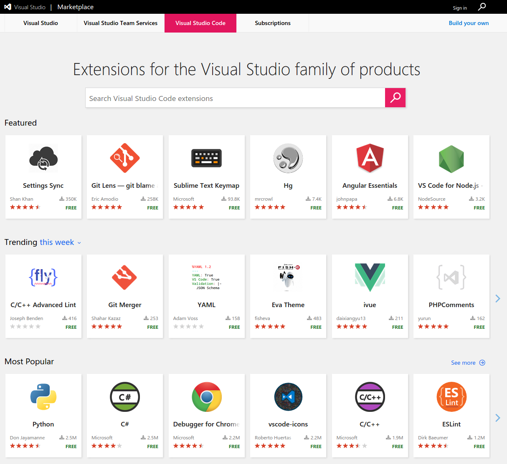

    

Recently I've been working with Visual Studio Code again. I generally use Visual Studio Code, Atom, and various Jetbrains products to get things done day to day. There are a ton of plugins, the following are a few of the plugins I find myself using regularly.

    

The first plugin I like to get for Visual Studio Code is the Settings Sync.