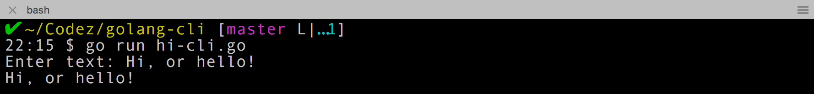
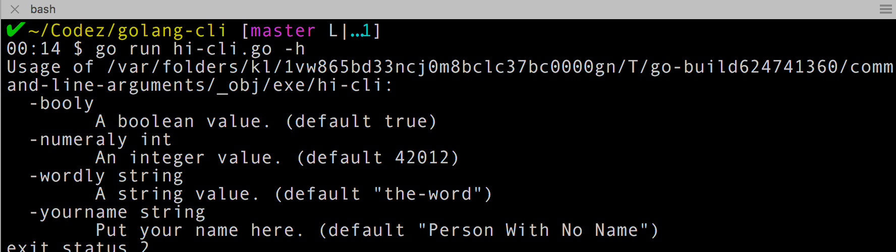
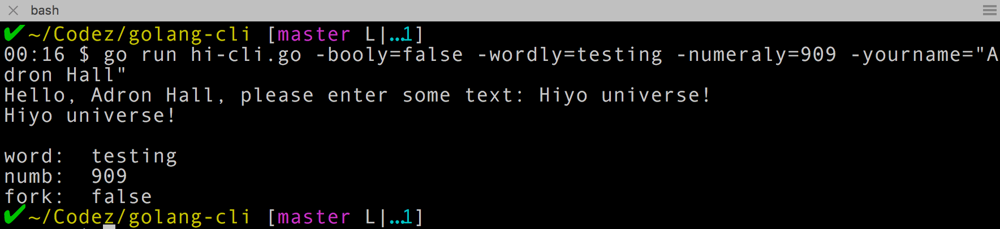

<div class="image float-left">
    
</div>

I sat in seat 20B on United Airlines Flight UA 949, enjoying the roominess of the Boeing 777 in service on this route between London (LHR) and San Francisco (SFO). At this time I decided it was time to hack together a [Go](https://golang.org/) [CLI](https://en.wikipedia.org/wiki/Command-line_interface) Project.

**Mission:** Create a Command Line Interface (CLI) that takes some flags, basic user input, and prints out something.

<span class="more"></span>

<div class="image float-right">
    
</div>

I quickly threw together just a simple "hi" CLI App.

```javascript
package main

import "fmt"

func main() {
    fmt.Println("Hi")
}
```

Then I ran that just to make sure I had Go installed properly and all that.

```shell-script
go run hi-cli.go
```

That's super boring, so first things first, let's take some input from the command line and print it back out to the screen. I'll start by passing a few parameters along with the hi-cli call.

```javascript
package main

import (
    "bufio"
    "fmt"
    "os"
)

func main() {
    reader := bufio.NewReader(os.Stdin)
    fmt.Print("Enter text: ")
    text, _ := reader.ReadString('\n')
    fmt.Println(text)
}
```

What this bit of code gives me looks like this when I execute it now.



A quick few notes if you're not familiar with Go. The := is a reassignment (or assignment) and declaration operator. It's actually equivalent to the following statement.

```javascript
var reader = bufio.NewReader(os.Stdin)
```

So that's the notion behind the := syntax.

Ok, so now I wanted some other features to the cli. The first is the ability to pass in some flags. There is a library for that, simply called *flag* which I'll add. I added that to the import list.

One of the really cool features of the flag library is that it will auto-generate flag help documentation. To display the flag documentation pass the -h flag. For instance, to see the flag documentation type in `go run hi-cli.go -h`. However, I need to actually add some flags with their appropriate descriptions and actually use them somewhere. So I've edited my go code file as shown.

```javascript
func main() {
  wordFlag := flag.String("wordly", "the-word", "A string value.")
  numberFlag := flag.Int("numeraly", 42012, "An integer value.")
  booleanFlag := flag.Bool("booly", true, "A boolean value.")
  nameFlag := flag.String("yourname", "Person With No Name", "Put your name here.")

  flag.Parse()

  var reader = bufio.NewReader(os.Stdin)
  fmt.Print("Hello, " + *nameFlag + ", please enter some text: ")
  text, _ := reader.ReadString('\n')
  fmt.Println(text)

  fmt.Println("word: ", *wordFlag)
  fmt.Println("numb: ", *numberFlag)
  fmt.Println("fork: ", *booleanFlag)
}
```

Now I can ask for help with the `go run hi-cli.go -h` and I get the following.



That's what I expected, so now I'm going to test out the different flags I set. So I go ahead and set each of the flags just to see. My command reads nice and long as `go run hi-cli.go -booly=false -wordly=testing -numeraly=909 -yourname="Adron Hall"`.



Again, everything I expected. Based on the mission I set out at the beginning of this entry, mission is accomplished. So until next time, happy hacking.
