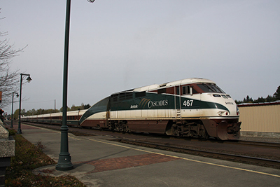
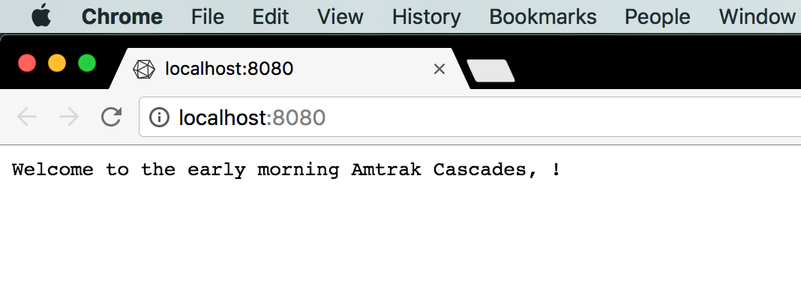
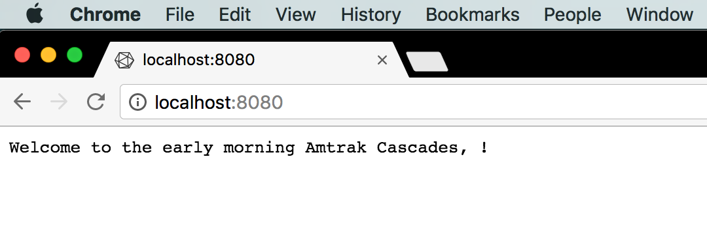
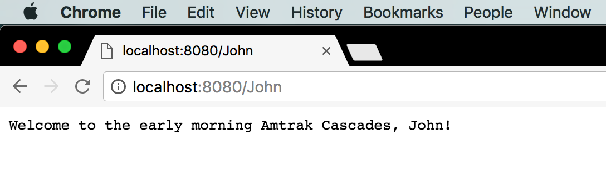
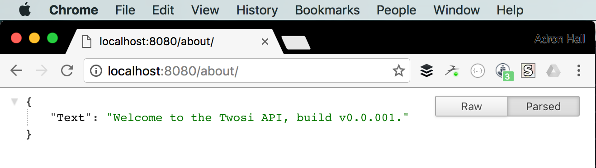

In the last post, I put together a quick Go CLI that took some flags and acted upon each of the flags. So today, instead of a Bowing 777 I'm aboard Amtrak Cascade's service to Portland (from Seattle) aboard a *Tren Articulado Ligero Goicoechea Oriol*, or *Talgo* Train.

<div class="image float-right">
    
</div>

Traveling in comfort is an unbelievably great way to get some coding done. It's easy to disconnect form interruptions (albeit there is internet access, but just enough, not to much) and just get some coding done. **Mission:** *Put together a service that has a basic response for a request, with some message. There needs to be a root response of the service, but also a response from one or more URI end points.*

<span class="more"></span>

The first thing I did was get the basic package designated and added the imports I'd need for the libraries I'd use for this. I created a file called `service.go` to add this code to.

```javascript
package main

import (
  "fmt"
  "log"
  "net/http"
)
```

Next I added a little trip specific message for the hello world aspect of the service.

```javascript
func handler(w http.ResponseWriter, r *http.Request) {
    fmt.Fprintf(w, "Welcome to the early morning Amtrak Cascades, %s!", r.URL.Path[1:])
}
```

This is a super simple handler that works to handle the request and response by returning a message. Note the parameter `r.URL.Path[1:]` that is passed in via the `%s` if it is available.

For the last bit of this sample I added the necessary main function.

```javascript
func main() {
    http.HandleFunc("/", handler)
    log.Fatal(http.ListenAndServe(":8080", nil))
}
```

Here I call the http function `HandleFunc` and pass in the necessary parameters, including the handler. Next I pass to the log function `Fatal` the http `ListenAndServe` function and pass it the port 8080 to listen on.

Now I built the code and run it to prove it out. To build I executed the standard go build command.

```shell-script
go build service.go
```

Then executing the service.

```shell-script
19:47 $ ./service
_
```

If for some reason you have something using that port already, the following error displays.

```shell-script
19:48 $ ./service
2016/11/03 19:48:15 listen tcp :8080: bind: address already in use
```

This happened to me routinely since I was running the `wintersmith preview` instance on port 8080 while I write this very blog entry. I try to prevent port conflicts, but one knows how that goes, sometimes you just gotta lock horns with all the ports.

If everything runs accordingly however, I get the following when I browser to http://localhost:8080.



## Add Features

What I did so far didn't really meet the mission statement to the extent I wanted to. I decided to add a few more things, so I went ahead and created another file in the repo called `service-twosi.go`. No, I don't know why I named it that other than naming is hard and this is the second services example.

Again, added the package and imports, which were almost the same as before.

```javascript
package main

import (
   "encoding/json"
   "fmt"
   "net/http"
   "log"
)
```

I wanted to get some json action into place, thus the addition of the encoding/json library.

Next I basically kept the previous response writer handler function.

```javascript
func handler(w http.ResponseWriter, r *http.Request) {
   fmt.Fprintf(w, "Welcome to the early morning Amtrak Cascades, %s!", r.URL.Path[1:])
}
```

Next I added a simple struct message type.

```javascript
type Message struct {
   Text string
}
```

This would be for the message and json manipulation. Next I added a function called about, which would eventually be an API call directly to http://localhost:8080/about. Note I've assigned m the Message, which is parsed into json via the json Marshal function call.

I then added a little error catch in case the json blows up for whatever reason. Then I write it out via this function.

```javascript
func about (w http.ResponseWriter, r *http.Request) {

   m := Message{"Welcome to the Twosi API, build v0.0.001."}
   b, err := json.Marshal(m)

   if err != nil {
       panic(err)
   }

    w.Write(b)
}
```

Finally, it's main function time again.

```javascript
func main() {
   http.HandleFunc("/", handler)
   http.HandleFunc("/about/", about)
   log.Fatal(http.ListenAndServe(":8080", nil))
}
```

A quick build.

```shell-script
go build service-twosi.go
```

Then execution.

```shell-script
./service-twosi
```

Gives me this.

```shell-script
20:09 $ go run service-twosi.go
_
```

Now if I navigate to http://localhost:8080/ I get this.



If I pass in a name as part of the URI like http://localhost:8080/John I get the following.



Of course the last URI to try out is the about URI path of http://localhost:8080/about which provides some nice json data returned in the browser.



That covers this mission, features implemented and done.

**References:**

* [Github Repo](https://github.com/Adron/golang-service)
* [Go language site](https://golang.org/)
