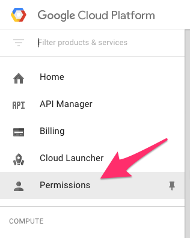
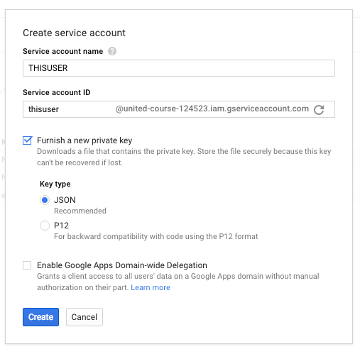
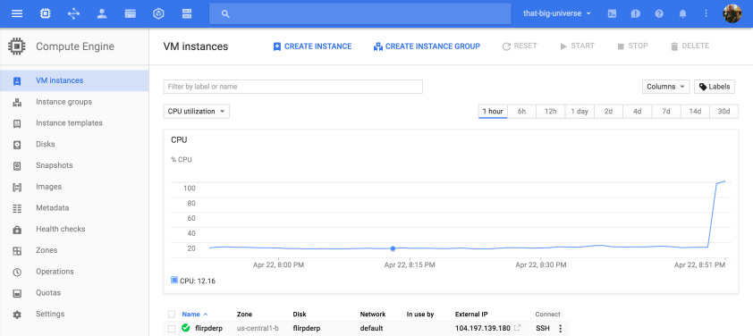

**Mission:** I wanted to setup an instance, that I could install various things on and prepare it to act as a Terraformer or central server within GCE to spawn instances, setup networks, and generally manage the network autonomously of any local scripts or junk I have on my local computer. To set this up, I would of course have to launch it from my local computer, so there's a whole range of things I'd need to have execute. To accomplish this, here's what I did.

## First Steps: Google Compute Engine

First I logged in and setup a GCE Account ([read specifically about creating and getting started with a GCE account](https://cloud.google.com/compute/docs/quickstart)) and got <em>gcloud</em> configured. The <em>gcloud</em> is a cli to manage GCE. It's actually a super powerful tool that comes in handy for all sorts of things. Besides managing GCE, it has a thin wrapper around <a href="https://en.wikipedia.org/wiki/Secure_Shell" target="_blank">ssh</a>, <a href="https://en.wikipedia.org/wiki/Secure_copy" target="_blank">scp</a>, and working with servers with those respective tools. I'll use it a bit later to actually run some scripts against the instance I'll be creating.

Once you've signed up for GCE there's a few things worth noting. One is the idea of the <em>project</em> that Google uses within GCE. This is something you're create, or rename the default, or in some way bring into existence to use. A <em>project</em> is something that a host of instances, instance groups, load balancers, networks, networking, and more can be allocated against. It's also something that can be setup for or inside a specific billing group. It might also be helpful to really get an understanding of what a <em>project</em> is by reading the <a href="https://cloud.google.com/compute/docs/projects" target="_blank">Google documentation on <em>projects</em></a>.

Once the project is ready, we can move forward with installing <em>gcloud</em>. The way this is done is by installing the Google Cloud SDK. The curl below pulls down and executes the installation. Then the following command restarts the shell. Finally the gcloud init command kicks off the initialization of the gcloud cli.

    curl https://sdk.cloud.google.com | bash
    exec -l $SHELL
    gcloud init

Running gcloud init does several things.

* Authenticates the user (or allows re-use of saved credentials).
* Requests the user's project &amp; saves it in the gcloud configuration.
* Requests and sets a default zone based on the project in the gcloud configuration.

At this point gcloud is setup for use, however upon connecting for the first time to an instance, gcloud will prompt to create a new ssh key set. This key set will be created and autonomous of the key set I have setup for git or other cli ssh tooling I'll use. I'll talk more about that later. NOTE: It is very important for subsequent steps to insure the gcloud ssh key is generated. I'll get around to that in a moment under the "<a href="#gcloudterraform"><em>User gcloud w/ Terraform</em></a>" section.

The specific instructions for setting up *gcloud* are also available here in [getting started with the Google Cloud SDK](https://cloud.google.com/sdk/). This includes a little more description of what is included and related information about the Google Cloud SDK.

<h3 id="gcloudterraform">Using gcloud w/ Terraform</h3>

When building Terraform configurations for Google Cloud there are a number of settings that <em>gcloud</em> can pull up very easily. Here are some of the commands I've used most frequently when setting up google compute instances.

List machine types in a project in table.

    gcloud compute machine-types list

List the URIs of all machine types in a project.

    gcloud compute machine-types list --uri

List all machine types in the us-central1-b and europe-west1-d zones.

    gcloud compute machine-types list --zones us-central1-b europe-west1-d

List all images in a project in table.

    gcloud compute images list

List all the URI images in a project.

    gcloud compute images list --uri

The last thing is connecting to instances, with <em>gcloud</em> looks like the following.

    gcloud compute --project "project-name" ssh --zone "us-central1-b" "instance-name"

There's some super useful ways to execute commands with the <em>gcloud</em> cli, which provides a great way for bash scripting against instances.

These all provide quick ways to get the specific GCE specific settings for the Terraform file. Which brings up a perfect point to get into a basic Terraform instance creation.

## Next: Terraforming with Terraform

If you don't have <a href="https://www.terraform.io/" target="_blank">Terraform</a> installed, the following bash commands will get you all setup on your machine. With this script below I can wrap this up as an installation script for the instance further along in this how-to. We'll just have to tweak it specifically for Linux, as this script is focused around downloading and installing the Darwin (OS-X) version.
    
    cd /home/adron
    
    # Create a move into directory.
    mkdir terraform_0_6_14
    cd terraform_0_6_14
    
    # Download.
    curl -O https://releases.hashicorp.com/terraform/0.6.14/terraform_0.6.14_darwin_amd64.zip
    # Unzip and install
    unzip terraform_0.6.14_darwin_amd64.zip
    
    export PATH=/home/terraform_0_6_14:$PATH

To confirm that Terraform is installed correctly, just type terraform. The following should be displayed, which will let you know that the path variable is set to the correct path.

    $ terraform
    usage: terraform [--version] [--help] <command> [<args>]
    
    Available commands are:
        apply       Builds or changes infrastructure
        destroy     Destroy Terraform-managed infrastructure
        get         Download and install modules for the configuration
        graph       Create a visual graph of Terraform resources
        init        Initializes Terraform configuration from a module
        output      Read an output from a state file
        plan        Generate and show an execution plan
        push        Upload this Terraform module to Atlas to run
        refresh     Update local state file against real resources
        remote      Configure remote state storage
        show        Inspect Terraform state or plan
        taint       Manually mark a resource for recreation
        untaint     Manually unmark a resource as tainted
        validate    Validates the Terraform files
        version     Prints the Terraform version

You may also want to add the PATH to the ~/.bash_profile on your own OS-X machine, like I did. Instead of that last bit of script that just exports the PATH variable, I swapped it out with the following code.

    echo "
    export PATH=/home/terraform_0_6_14:$PATH
    " >> ~/.bash_profile

Yes, the odd spacing and new lines are important, because that will append the export to PATH in a way that provides space before and below the line. It just leaves the ~/.bash_profile file looking a little cleaner.

Once you've added it to your ~/.bash_profile, remember to either restart the terminal or source the file to get the PATH variable updated.

    source ~/.bash_profile

The next thing we'll need for Terraform use with GCE is the <em>account.json</em> file. This is the file that a service account sets up to secure our connection between GCE and Terraform.

Navigate to the Permissions section of the GCE interface and add a service account. When you click to create a service account you'll be prompted with the following.

Here check the "Furnish a new private key" and click on the JSON for the key type. Then create create. This will create the service account and the key will download locally. The key is not named account.json, but the file downloaded is what to use as the account.json file, it just needs renamed.

Now we're ready to get into actually putting together an infrastructure project. Let's start with a basic setup. First I need the following files.

* account.json
* theterraformfile.tf

These are needed files and will get a terraform workflow started, but I break them out a bit more. Terraform files after all are all collected and then processed, so the configuration doesn't have to all be in a single file.

What I have been doing lately, is take the terraform file and break it out accordingly. For the connection I create a connection.tf file, for configuration around instances I create an instances.tf file, for network addresses (static IPs) that goes in an addresses.tf file. If any of those files get to big within a project I break those out further like instance-instancename1.tf and instance-instancename2.tf.

With that practice applied, I end up with a project with the following files.

* account.json
* instances.tf
* addresses.tf

I then run git init and add two more files.

* .gitignore
* README.md

These have no relevance to the actual Terraform files, but they're standard practice and come in very helpful once the project starts to grow. You'll want a README.md for notes and documentation and you'll definitely want to keep trash out of the project with the .gitignore, so even though they're not required right now, if you're following along add the files.

In the <a href="https://github.com/Adron/starting-with-gce/blob/master/README.md" target="_blank">README.md</a>, of course, we write our documentation! So anyway, it'll be there in the <a href="https://github.com/Adron/starting-with-gce" target="_blank">repo</a> I've created for this blog entry here.

In the .gitignore file add the following.

    .DS_Store
    account.json

In the connection.tf file I added the following connection information. The ${file("../secrets/account.json")} configuration interpolates the path of the file based on where the project is located and pulls in the appropriate values for GCE.

    # Configure the Google Cloud provider
    provider "google" {
      credentials = "${file("account.json")}"
      project     = "that-big-universe"
      region      = "us-central1"
    }

With that in place, I added this to the instances.tf file.

    # Create a new instance
    resource "google_compute_instance" "flirpderp" {
        name = "flirpderp"
        machine_type = "f1-micro"
     
        zone = "us-central1-b"
     
        disk {
            image = "ubuntu-1404-trusty-v20160406"
        }
     
        network_interface {
            network = "default"
            access_config {}
        }
     
        service_account {
            scopes = ["userinfo-email", "compute-ro", "storage-ro"]
        }
    }

To get the machine_type and disk image above I just used the following gcloud commands.

    gcloud compute machine-types list

and

    gcloud compute images list

For this first build, I just wanted to get a basic template with a small (and by association super cheap) instance. For this I went with <em>f1-micro</em>. For the disk, I used the base disk image load of the <em>ubuntu-1404-trusty-v20160406</em>.

All configuration set, I opened up a bash terminal and typed in the following.

    terraform plan

This command then displayed the following result.

    Refreshing Terraform state prior to plan...
     
    The Terraform execution plan has been generated and is shown below.
    Resources are shown in alphabetical order for quick scanning. Green resources
    will be created (or destroyed and then created if an existing resource
    exists), yellow resources are being changed in-place, and red resources
    will be destroyed.
     
    Note: You didn't specify an "-out" parameter to save this plan, so when
    "apply" is called, Terraform can't guarantee this is what will execute.
     
    + google_compute_instance.flirpderp
        can_ip_forward:                                      "" => "0"
        disk.#:                                              "" => "1"
        disk.0.auto_delete:                                  "" => "1"
        disk.0.image:                                        "" => "ubuntu-1404-trusty-v20160406"
        machine_type:                                        "" => "f1-micro"
        metadata_fingerprint:                                "" => "<computed>"
        name:                                                "" => "flirpderp"
        network_interface.#:                                 "" => "1"
        network_interface.0.access_config.#:                 "" => "1"
        network_interface.0.access_config.0.assigned_nat_ip: "" => "<computed>"
        network_interface.0.address:                         "" => "<computed>"
        network_interface.0.name:                            "" => "<computed>"
        network_interface.0.network:                         "" => "default"
        self_link:                                           "" => "<computed>"
        service_account.#:                                   "" => "1"
        service_account.0.email:                             "" => "<computed>"
        service_account.0.scopes.#:                          "" => "3"
        service_account.0.scopes.1632638332:                 "" => "https://www.googleapis.com/auth/devstorage.read_only"
        service_account.0.scopes.2428168921:                 "" => "https://www.googleapis.com/auth/userinfo.email"
        service_account.0.scopes.2862113455:                 "" => "https://www.googleapis.com/auth/compute.readonly"
        tags_fingerprint:                                    "" => "<computed>"
        zone:                                                "" => "us-central1-b"
     
    Plan: 1 to add, 0 to change, 0 to destroy.

Let's walk through this result to get an idea of what just happened. Terraform has taken all of the Terraform files, which currently is only one file with actual configuration in it, and processed them to create a plan of changes. At the very bottom of the results the line "Plan: 1 to add, 0 to change, 0 to destroy." simple shows what will occur if I were to apply these changes. Many of the values are also set as which simply means that when processed they'll be calculated and set. Otherwise most of the other values are simply the settings I've put in via the actual Terraform configuration files.

Now I applied the configuration.

    terraform apply

The output of this command will display as shown.

    google_compute_instance.flirpderp: Creating...
      can_ip_forward:                                      "" => "0"
      disk.#:                                              "" => "1"
      disk.0.auto_delete:                                  "" => "1"
      disk.0.image:                                        "" => "ubuntu-1404-trusty-v20160406"
      machine_type:                                        "" => "f1-micro"
      metadata_fingerprint:                                "" => "<computed>"
      name:                                                "" => "flirpderp"
      network_interface.#:                                 "" => "1"
      network_interface.0.access_config.#:                 "" => "1"
      network_interface.0.access_config.0.assigned_nat_ip: "" => "<computed>"
      network_interface.0.address:                         "" => "<computed>"
      network_interface.0.name:                            "" => "<computed>"
      network_interface.0.network:                         "" => "default"
      self_link:                                           "" => "<computed>"
      service_account.#:                                   "" => "1"
      service_account.0.email:                             "" => "<computed>"
      service_account.0.scopes.#:                          "" => "3"
      service_account.0.scopes.1632638332:                 "" => "https://www.googleapis.com/auth/devstorage.read_only"
      service_account.0.scopes.2428168921:                 "" => "https://www.googleapis.com/auth/userinfo.email"
      service_account.0.scopes.2862113455:                 "" => "https://www.googleapis.com/auth/compute.readonly"
      tags_fingerprint:                                    "" => "<computed>"
      zone:                                                "" => "us-central1-b"
    google_compute_instance.flirpderp: Creation complete
     
    Apply complete! Resources: 1 added, 0 changed, 0 destroyed.
     
    The state of your infrastructure has been saved to the path
    below. This state is required to modify and destroy your
    infrastructure, so keep it safe. To inspect the complete state
    use the `terraform show` command.
     
    State path: terraform.tfstate

I logged in at this point to verify the creation of the instance.

In the interface the instance (or instances if I have multiple) shows up in a list underneath the fancy CPU utilization chart.

### Cleanup

Since I don't actually want this instance to stay live currently, to destroy the instance I can use the terraform destroy command. If there were other instances in this set of Terraform configuraiton files, it would also destroy those too. Destroy, suffice to say is something that is very destructive and should be used carefully. For this example I'm going to destroy this instance now, but since I have the configuration I'll add a little bit more to it and recreate it shortly.

I issue this command.

    terraform destroy

This displays...

    Do you really want to destroy?
      Terraform will delete all your managed infrastructure.
      There is no undo. Only 'yes' will be accepted to confirm.
    
      Enter a value: yes

Then I confirm by typing 'yes' and then the following result of this acction is returned.

    google_compute_instance.flirpderp: Refreshing state... (ID: flirpderp)
    google_compute_instance.flirpderp: Destroying...
    google_compute_instance.flirpderp: Destruction complete
    
    Apply complete! Resources: 0 added, 0 changed, 1 destroyed.

At this point, it's pretty cool that I can build a single instance, but that's of extremely limited use if I can't get it deployed out into GCE in a usable state. The most common ways I'd want to wrap up configuration and installation of software on an instance is to issue some bash commands to the instance. Well, Terraform has ways that exactly that can be done. I'll cover that in the follow up to this article.

### References:

* [The Github Repository branch for this blog entry.](https://github.com/Adron/starting-with-gce/tree/blog-entry-01)
