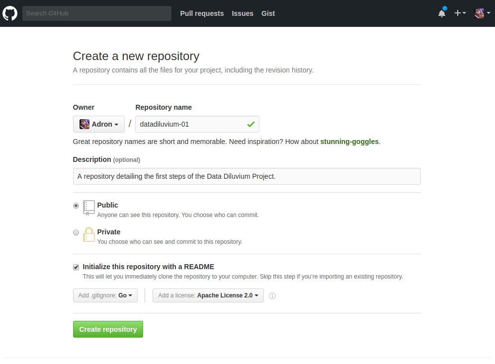
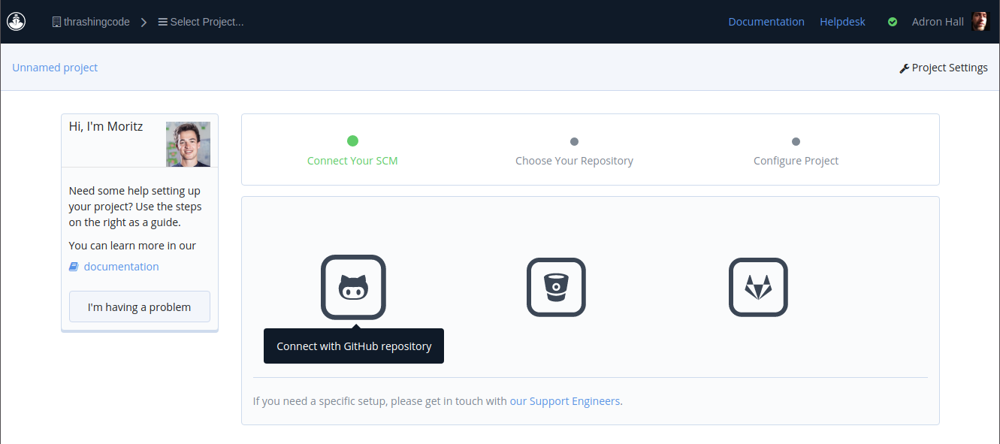
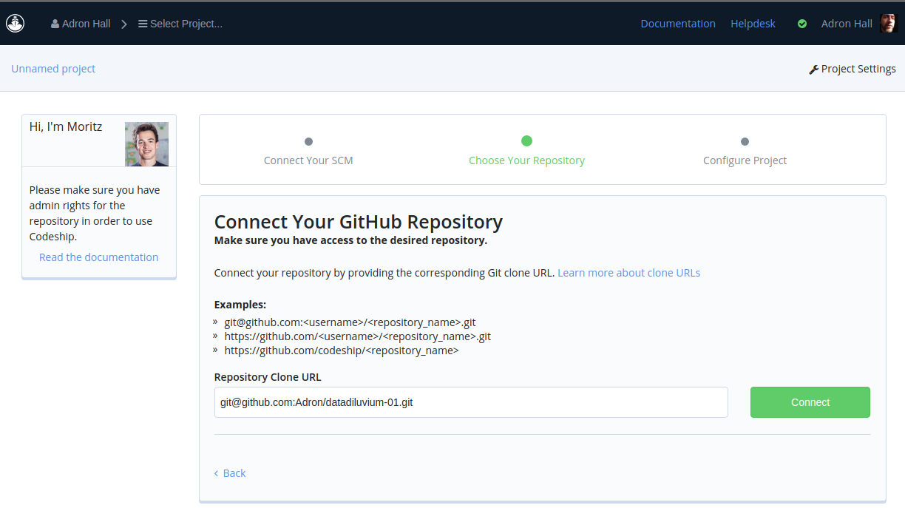
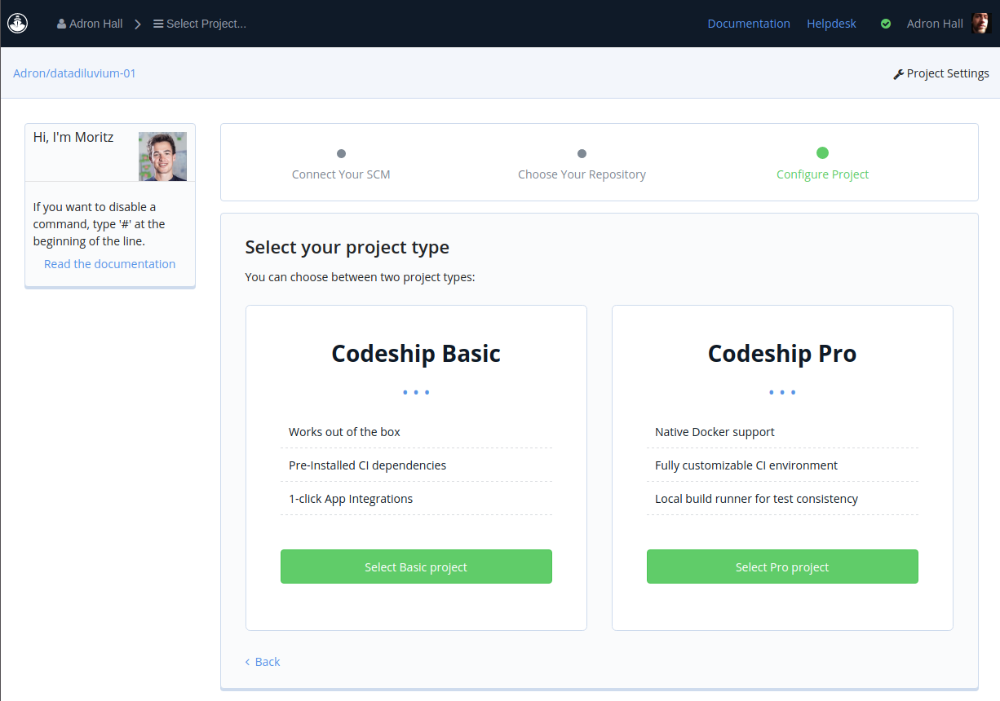
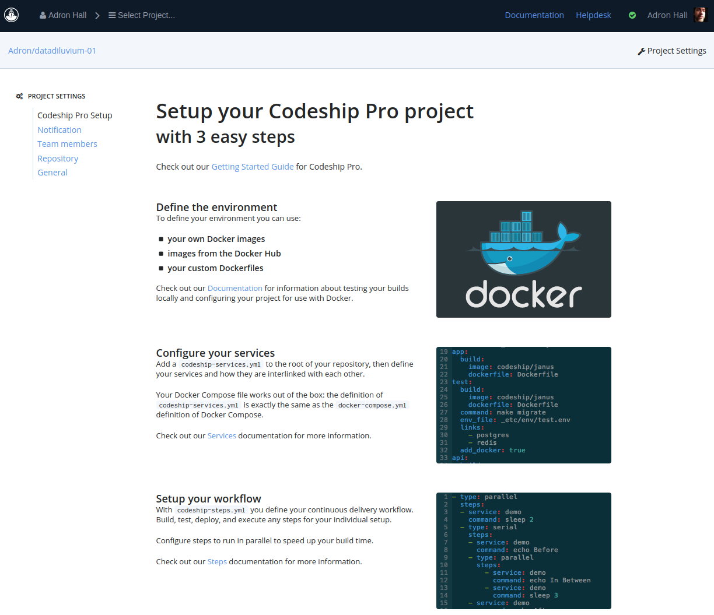
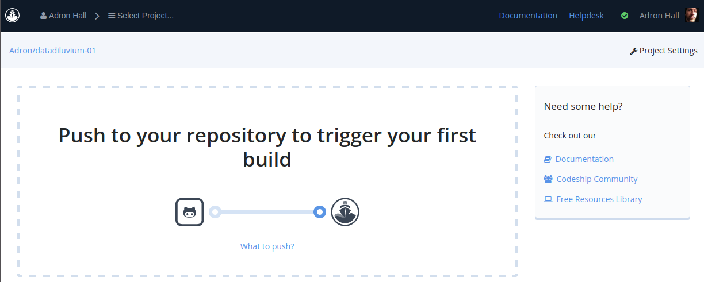
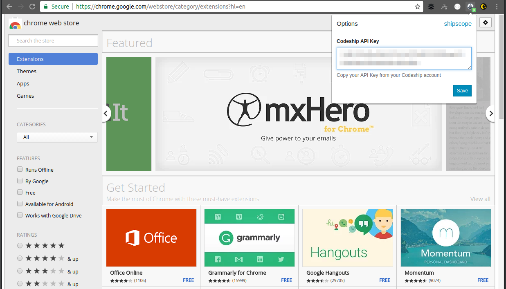
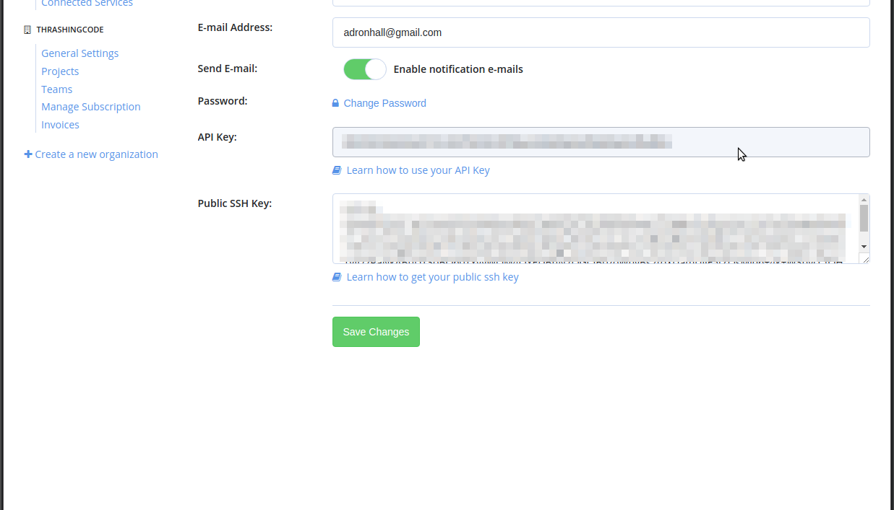
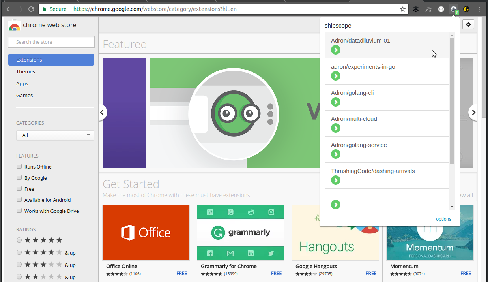
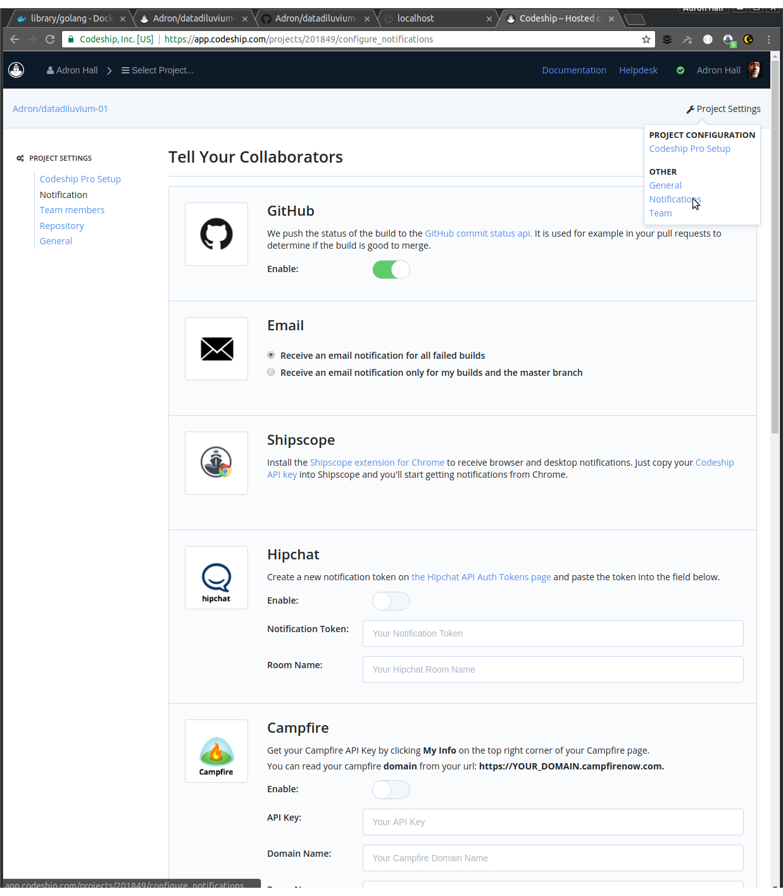

Today Go enjoys a lot of popularity for a number of reasons. It's a solid language that enjoys a lot of advantages. Some include its simple nature and how it works exceptionally well in the container based, cloud native, distributed world of today.

With this post I'm kicking off a series focused around building out and implementing a services application, based on container tech and cloud native principles. There are a few prerequisites I've assumed listed below.

**Prerequisites:**

* [Go](https://golang.org/dl/) version 1.6.3 is used and almost any current version can be used.
* [Codeship Account](https://codeship.com/)
* [Jet CLI](https://documentation.codeship.com/pro/getting-started/installation/)
* [Docker](https://docs.docker.com/engine/installation/)

## Tech, Capabilities, Implementation

In this series there are several key ideas behind the technologies, capabilities, and implementation details that I'll cover.

* Microservices - Building an application that will provide data generation.

* Containers - Use, creation, and management of containers for the build and delivery process.

The project I'll create is an example, but it is important to note the practices I'll follow are just as valid to a full blown project getting started.

## A Go Project

As a first step, I need a simple Go project. I'll use this to start building the systems for continuous integration and delivery around it. Whenever starting a project it is most ideal to implement the systems around the project as early as possible.

To accomplish this task I created a repository on Github. I could then use it to manage the tasks at hand and of course store my code in. When I created the project I used Github's option to add a README.md, LICENSE, and Go based .gitignore file.



Once created I went ahead and added an [issue "Create a minimal Go Service to work with for CI/CD."](https://github.com/Adron/datadiluvium-01/issues/1), just for a process flow and to ensure good visibility into the project flow.

Next I cloned the repository.

```
git clone git@github.com:Adron/datadiluvium-01.git
```

With the repository cloned I added a *main.go* file and went about creating the basic Go service to work with.

```go
package main

import (
   "fmt"
   "log"
   "net/http"
)

func main() {
    http.HandleFunc("/", func(w http.ResponseWriter, r *http.Request) {
      fmt.Fprintf(w, "Hello!")
    })

    log.Println("Listening on 8080...")
    log.Fatal(http.ListenAndServe(":8080", nil))
}
```

Just to test that out I run a quick `go run main.go`.

Next I commit this code in commit [fc7e9e3c2f7064833830a490fb77b17c2acd7675](https://github.com/Adron/datadiluvium-01/commit/fc7e9e3c2f7064833830a490fb77b17c2acd7675) that completes [issue #1](https://github.com/Adron/datadiluvium-01/issues/1).

## Continuous Integration Local Build

I can now execute a local build with the [Codeship Pro CLI](https://documentation.codeship.com/pro/) called [Jet](https://documentation.codeship.com/pro/getting-started/installation/). The [Codeship Documentation](https://documentation.codeship.com/) has a great [tutorial on getting started with Jet](https://documentation.codeship.com/pro/getting-started/getting-started/), but I'm going to go over the specifics for getting started with Jet for this project here.

The next steps are getting a local build and then getting a remote Codeship build working. To get the local build working first I'll use the Jet CLI and create the two local yaml files to inform the Jet CLI on how to build the project. These two files are named as shown:

* *codeship-services.yml* - This is the file that will list out any of the services that need built to run the build. I only need a single service for the Go service. I added the following configuration to the file for creation of the service.

    ```yaml
    datadiluvium:
      build:
        image: golang
        dockerfile_path: Dockerfile
    ```
    
    I don't have a Dockerfile just yet, but I'll add that shortly. I named the image *golang* to match the image used from Docker hub.

* *codeship-steps.yml* - This file lists out the steps that will be run for the build. At this point I want to have three steps run: ``, ``, and ``. I added the following configuration to the codeship-steps.yml file.

    ```yaml
    - name: sailing
      service: datadiluvium
      command: go clean
    - name: sailing_tests
      service: datadiluvium
      command: go test .
    - name: sailing_build
      service: datadiluvium
      command: go build
    ```

These are the two files that are specific to the Jet CLI for the build, however I still need a Dockerfile to designate which image to retrieve to run the container, which will then in turn run the build. The Dockerfile also will include the working directory and run of anything else that needs installed on the container for the execution of the build.

*Dockerfile*

```dockerfile
FROM golang:1.7.4-alpine

ENV GOPATH /go

RUN mkdir /app && \
    apk add --update curl && \
    rm -rf /var/cache/apk/*

ADD . /app/
WORKDIR /app
```

With those files in place, I can now run a local build with `jet steps`.

```shell-script
$ jet steps
***WARNING*** linux detected, --no-remove is recommended to be set to docker bug with linux [https://github.com/docker/docker/issues/9665](https://github.com/docker/docker/issues/9665)
{StepStarted=step_name:"sailing"}
{BuildImageStarted=image_name:"golang" service_name:"datadiluvium"}
{BuildImageStdout=image_name:"golang" service_name:"datadiluvium"}: Step 1/5 : FROM golang:1.7.4-alpine
{BuildImageStdout=image_name:"golang" service_name:"datadiluvium"}:  ---> 00371bbb49d5
{BuildImageStdout=image_name:"golang" service_name:"datadiluvium"}: Step 2/5 : ENV GOPATH /go
{BuildImageStdout=image_name:"golang" service_name:"datadiluvium"}:  ---> Using cache
{BuildImageStdout=image_name:"golang" service_name:"datadiluvium"}:  ---> 47d0bc36a3ac
{BuildImageStdout=image_name:"golang" service_name:"datadiluvium"}: Step 3/5 : RUN mkdir /app &&     apk add --update curl &&     rm -rf /var/cache/apk/*
{BuildImageStdout=image_name:"golang" service_name:"datadiluvium"}:  ---> Using cache
{BuildImageStdout=image_name:"golang" service_name:"datadiluvium"}:  ---> 063d3df11384
{BuildImageStdout=image_name:"golang" service_name:"datadiluvium"}: Step 4/5 : ADD . /app/
{BuildImageStdout=image_name:"golang" service_name:"datadiluvium"}:  ---> 4d7a7f79be33
{BuildImageStdout=image_name:"golang" service_name:"datadiluvium"}: Removing intermediate container c303781ccc55
{BuildImageStdout=image_name:"golang" service_name:"datadiluvium"}: Step 5/5 : WORKDIR /app
{BuildImageStdout=image_name:"golang" service_name:"datadiluvium"}:  ---> 59377d134135
{BuildImageStdout=image_name:"golang" service_name:"datadiluvium"}: Removing intermediate container f4ff4edf13bf
{BuildImageStdout=image_name:"golang" service_name:"datadiluvium"}: Successfully built 59377d134135
{BuildImageFinished=image_name:"golang" service_name:"datadiluvium"}
{StepFinished=step_name:"sailing" type:STEP_FINISHED_TYPE_SUCCESS}
{StepStarted=step_name:"sailing_tests"}
{ContainerRunStdout=step_name:"sailing_tests" service_name:"datadiluvium"}: ?   	_/app	[no test files]
{StepFinished=step_name:"sailing_tests" type:STEP_FINISHED_TYPE_SUCCESS}
{StepStarted=step_name:"sailing_build"}
{StepFinished=step_name:"sailing_build" type:STEP_FINISHED_TYPE_SUCCESS}
```

Everything finished successfully. At this time however there is a caveat around Linux as warned at the top of the results. If you run into issues while running this on Linux, you might want to check out the --no-remove solution for [issue 9666](https://github.com/docker/docker/issues/9665). However if you're using OS-X/MacOS or Windows you'll likely just see the steps build as shown.

Now that I've got a successful build locally, I can move to getting the build setup on Codeship. One thing I always do just before this stage is add two more additions to the .gitignore file at this point. I usually forget, but the Jetbrains IDEs that I often use will remind me, or I'll notice the files I need to keep out of the commit when I run a `git status` before I add files to the commit. At that time I always add the `.idea` directory and `.DS_Store` files to my .gitignore file.

The .idea directory is simply the configuration and settings directory for Jetbrains IDEs and the .DS_Store file is a file that stores custom attributes of the containing folder. It has nothing to do with the actual code or project. It is similar to hidden files on Windows and Linux that sometimes end up in a commit. Keep an eye out and add those to the .gitignore so they don't end up cluttering up your project.

With a quick addition of the files to the commit, I pushed up all of the files with a `git push`. With the code safely in the Github repository I navigate to Codeship and login. Once logged in I select to *create a new project*.


This then brings up the dialog where a choice of Github, Gitlab, or Bitbucket can be chosen. I chose Github and the next dialog renders.



In this next dialog I've added the git@github.com:Adron/datadiluvium-01.git



Click on connect. The next step is to pick Codeship Basic or Codeship Pro. I click on *Select Pro project* and the next dialog renders.



This page isn't immediately useful to us, but has a few interesting reminders. However I just click on the project in the upper left corner *Adron/datadiluvium-01*. This brings me to the build results screen.



Right now I don't have a remote build since I haven't pushed any new commits to the repository since setting up the build project in Codeship.



I changed my *main.go* file to repeat and build up a buffer, then print the buffer out to a string formatted for the page output as shown.

```go
package main

import (
	"bytes"
	"fmt"
	"log"
	"net/http"
)

func main() {
	http.HandleFunc("/", func(w http.ResponseWriter, r *http.Request) {
		var buffer bytes.Buffer
		for i := 0; i < 1000; i++ {
			buffer.WriteString("a")
		}
		fmt.Fprintf(w, buffer.String()+"Hello!")
	})

	log.Println("Listening on 8080...")
	log.Fatal(http.ListenAndServe(":8080", nil))
}
```

Adding this code with a commit gave me a good build. With that setup I now wanted to a put a finishing touch on the build. For that finishing touch, I'd include a build badge and get the [Codeship Chrome Plugin "Shipscope"](https://chrome.google.com/webstore/detail/shipscope/jdedmgopefelimgjceagffkeeiknclhh?hl=en) working for local builds.

## Finishing Touches

**Shipscope**

To get this plugin I navigated over to the [Shipscope](https://chrome.google.com/webstore/detail/shipscope/jdedmgopefelimgjceagffkeeiknclhh?hl=en) plugin page and clicked to add it to Chrome.
 

 
Once it is added, click on the Shipscope Icon in the top right of the Chrome. To get the key navigate over to the account settings page. There the key, SSH key, and related security information is available. Copy it to the Shipscope Plugin.



Once that's done the plugin will start to display the build results for whatever is building under your account with Codeship.



**Badge(s)**

To get the initial Codeship Badge working, navigate to the notifications section.



I scroll to the bottom of this page to get a list of badges to add in various formats.


Here I choose the *Copy Markdown Syntax* and paste that into the top of the *README.md* file for the project. Now the badge shows up on the project's README.md file when viewed in Github. That sets us up perfectly to have good visibility and insight into our project as we move forward.

# Summary

I have a number of things that are setup that will help the project immensely as I move forward.

* Working and compilable code.
* A working continuous integration build locally using the Jet CLI.
* A working remote build that I or others working on the project can use with Codeship.
* Notifications in my browser and also in the README.md file.

Having these capabilities sets up the project so that I can move forward quickly and with high confidence that I'll be able to maintain a working build and bring others in with the same visilibity into the project at the same time.