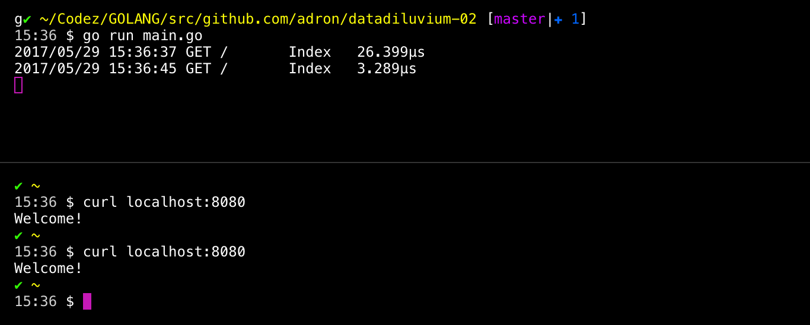
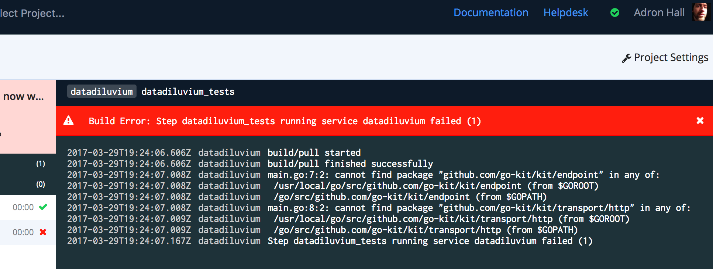
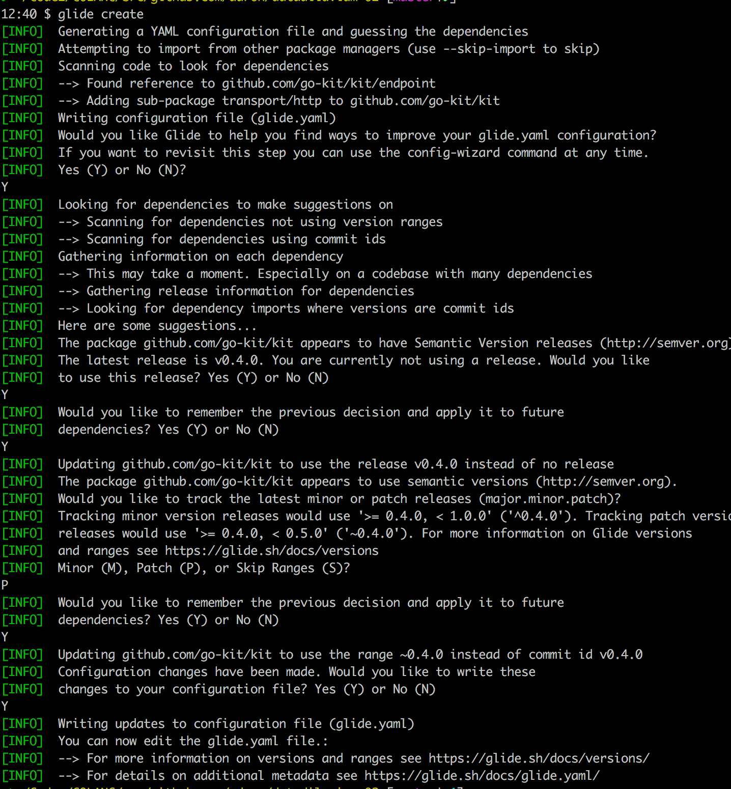

# Getting Go Going Continuously with Integration & Delivery on Codeship Pro - Stage II

Previously in this series I've put together all of the basic elements to insure I have a working build to develop from. This way I have the ability to make changes rapidly, change direction when needed, insure the code base is always building, tested, and able to be deployed. If you want to catch up and follow along step through the previous article of the series [here](#part1).

In this article I'm going to start stepping toward a working services product, and provide a description and details of what I intend to build.

## Application Description

The idea behind this application is to generate data. However I don't want to create just a simple data generator alone. Instead I want a system which can generate data and also place it into an appropriate location after generating the data. With this basic setup I would need 2 key pieces of information to pass along to the API, so that it can then generate the data and put the data into the location designated.

## Core Application Goals

* Provide an API that accepts parameters, via a schema, that then will be used to generate and identify where to put the data after generation.
* In the schema, the basic data will describe the structure of the data store in which the generated data will be inserted.
* In the schema, I'll also want to be able to designate the type, and how many of the specific piece of data to generate.

I've created an example below, to provide an idea of what would be passed into the API. At this point I'm not trying to determine exactly how something would work, specific criteria, or the details of verifying the data, but just simply a workflow to achieve basic functionality around the core goals.

<script src="https://gist.github.com/Adron/402a5e4b5e11554f72a663416ac6d92c.js"></script>

This example covers the core features. I've setup a schema and database key value pair, which I've set here to a relational schema setup for a Postgresql relational database. The connection parameter would be an array of key value pairs that would have the necessary information for connecting to the database. Below that the structure is where the database, which will be filled with generated data, is described.

At this point there are many other stories and feature requests I could come up with. At this point I know enough of the story to start building out some more of the systemic elements that are needed. I'll get right into that and step back into describing features after getting more of a feel for building this API service.

## Next Step Dependencies

I really need to get into the services at this point. Get something working to actually work from. Similar to how I have already put together the actual build with Codeship Pro. At the end of the last article in this series I had written a *hello world* style service, but that won't cut it. For this I want to use something that has features and capabilities focused around a service. This could and should cut back on a lot of the standard work that is needed. For this I'll use [Mux](http://www.gorillatoolkit.org/pkg/mux).

To get this library, I use the standard [Go Get](https://golang.org/cmd/go/) command. This command will retrieve an available library for use, creating a dependency within my project. In this case I want to get the Mux Package and start using it.

`go get github.com/gorilla/mux`

## Build Some Basic Features
 
To get things going I’ll just create a few key pieces that are needed. First, let’s create a Logger function to use for, well, ya know, logging.
 
<script src="https://gist.github.com/Adron/481f0df5af0403720adb3da6e6782cf5.js"></script>
 
Once I have that I’ll need to create a new router using mux, and the respective routes and a handler. Let’s first add the pieces needed for routes. First I’ll add a Route struct type, then an array of this type struct, then create a variable to hold routes of type Route. The code looks like this.
 
<script src="https://gist.github.com/Adron/ad15920b576118758d37112dbdcfe526.js"></script>
 
In the routes variable I go ahead and assign the root route, and give it a currently non-existent handler function name of `HandleThis`. This is however, the next piece of code I’ll add and immediately after I’ll add the function that’ll handle router creation based on the mux library.
 
<script src="https://gist.github.com/Adron/ef6312fe492b7ab0fa4d2adaa9546d92.js"></script>
 
Finally, I’ll add the main func that’ll kick all of this into gear and start the logger & service. Since I’ve broken apart the logger, router, handler, and routes appropriately, the main function is a simple two line function.
 
```
func main() {
	router := NewRouter()
	log.Fatal(http.ListenAndServe(":8080", router))
}
```
 
This now helps me prove out that I have a working service, with a simple curl command issued against the end point I can verify everything is running ok.
 
```
curl localhost:8080
```
 
Below I’ve executed a curl request against the root end point in the bottom terminal below. In addition, I’ve shown what the logger will print out when a curl is issued against the end point in the top terminal shown below.
 

 
At this point I'm going to detour and talk about the continuous integration process some more.

### The Build Has Broken!

If I take a step away from this working code and take a look at the build process, I've broken the build with this latest addition of code.



Looking at the second step here, where the tests attempt to execute, I've found my dependencies aren't available for the build. This error message allows me to reason and determine the issue:

* The dependencies are available locally, because I ran the `go get github.com/etc...` command to retrieve them.
* The build process has no step where the dependency is retrieved, and since every build is a brand new container derived from a base image that does not have these dependencies, they're not available.
* I'll need a step or command to call `go get` to retrieve these dependencies for the build.
* I may want to determine another dependency management solution for the project if I move beyond a single dependency like this.

That last point, is important since any reasonably sized Go project will end up with dozens, sometimes many dozens of dependencies. Managing which dependencies are executed where; locally, for the build, in dev, or production environments, could become very cumbersome. This is where vendoring and a dependency management tool like Glide comes in handy!

## Back to Dependencies, Implementing Glide

Glide is described on its README.md as

> "Are you used to tools such as Cargo, npm, Composer, Nuget, Pip, Maven, Bundler, or other modern package managers? If so, Glide is the comparable Go tool."

Basically, it's a Go vendor and vendored package management tool. In Go, there is a feature around keeping dependencies in a directory, called *vendor* that stores the various dependencies for a project.

Since the build has broken, and brought the issue of dependencies to the forefront of concern at the moment, I'm going to wrap up this installment of this series by installing Glide and adding the go-kit dependencies.

### Installing Glide


The easiest way to install glide is to install it with brew on the Mac or with apt-get on Linux. The command for OS-X is simply `brew install glide`. With Linux, the repository needs added first, then glide can be installed.

```
sudo add-apt-repository ppa:masterminds/glide && sudo apt-get update
sudo apt-get install glide
```

There are also binary packages if you would like to go that route, available [here](https://github.com/Masterminds/glide/releases). If you'd like to build your own binaries specifically for your system, that's also an option. I'll leave that path up to you to tackle via the Glide Project's [README.md](https://github.com/Masterminds/glide).

Once installed just typing `glide` will print out the available commands in the terminal, showing it has been installed properly. The next step after installation is to setup the project with Glide. To do so, issue the command `glide create`. When issuing the command, glide will then prompt to setup the appropriate configuration for the project and any other questions it needs answered.



Next I'll need to verify what the create process did, so I'll open up the newly created `glide.yaml` file. The contents, since the glide command scans through the project it is run within, looks like this.

```
package: github.com/adron/datadiluvium-02
import:
- package: github.com/go-kit/kit
  version: ~0.4.0
  subpackages:
  - endpoint
  - transport/http
```

The core package is go-kit or github.com/go-kit/kit while the two specific subpackages I'm using, are *endpoint* and *transport/http*. There are of course some other dependencies in there, but these dependencies generally all come from the core libraries that come with Go.

The next step is to tweak the Dockerfile so that it builds the container image appropriately, pulls glide, retrieves the dependencies, sets the GOPATH appropriately to where the project and dependencies are loaded, and builds the service. With changes, the complete Dockerfile I have now reads like this.

```
FROM golang:1.8-alpine

ENV GOPATH /go

RUN apk add --update git && rm -rf /var/cache/apk/* && \
    go get github.com/Masterminds/glide

ADD . /go/src/github.com/Adron/datadiluvium-02/
WORKDIR /go/src/github.com/Adron/datadiluvium-02

RUN cd /go/src/github.com/Adron/datadiluvium-02 && \
    glide install && \
    go test $(glide novendor)
```

I insured that the Alpine image I'm starting from uses the latest Go version. Next I set the GOPATH to `/go`. It's very important to insure that the app folder, vendor folder, the respective dependencies, and anything else needed to build the service all exist within this path.

Then I add and create my work directory for the project, `glide install` the dependencies into the image, and finally run `go test $(glide novendor)`. I ended up running the tests here for now, as the finally build will occur after the image is built in the steps of the yaml file. That brings up the next change, within the codeship-steps.yml file. I changed it to correlate appropriately to the Dockerfile changes and it now looks like this.

```
    - name: datadiluvium_cleanup
      service: datadiluvium
      command: go clean
    - name: datadiluvium_build
      service: datadiluvium
      command: go build
```

Notice I removed some previous steps and now just clean and then build the code. The build process service automatically build the container image itself, so I'm all set now for the build with full dependency support.

## Summary

In this post I’ve covered a fair amount of distance toward a fully functioning Data Diluvium Project. First coverage of what the key feature stories are for the Data Diluvium Project itself. I've covered coding up a working service, from first principles, into a working service that accepts JSON. This provides the groundwork in which I can now start writing code toward processing the JSON the service would receive. From that point, I took a break from coding to extend the capabilities of the project to handle dependency management with Glide. Finally wrapped up this part with some changes to insure a good build with the new dependency management in place.
