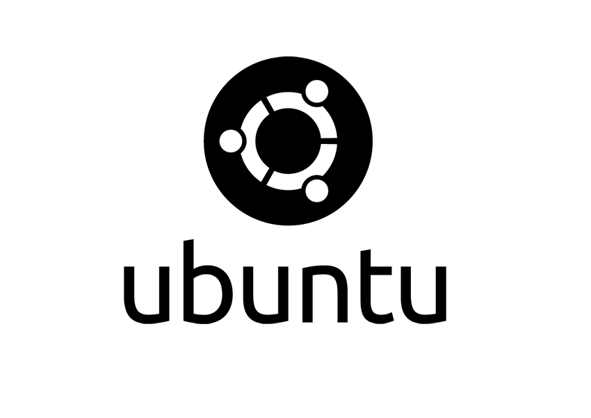

* [Git](#git)
* [Atom Editor](#atom)
* [Node.js](#nodejs)
* [Java](#java)
* [WebStorm](#webstorm)
* [IntelliJ Community Edition](#intellij)
* [Sublime 3](#sublime)
* [C# Mono Develop](#csharp)
* [Unity Tweak Tool](#unity-tweak-tool)
* [Themes for Unity Tweak Tool](#themes)

**Prerequisites**

* Always run sudo apt-get update once the system is installed. It never hurts to have the latest updates.[sourcecode language="bash"]sudo apt-get update
sudo apt-get upgrade[/sourcecode]
* Install curl, because it's used everywhere dammit.[sourcecode language="bash"]
curl -sL https://deb.nodesource.com/setup | sudo bash -
[/sourcecode]
* One thing that ends up, at some point, always being needed for builds is the build-essential.[sourcecode language="bash"]apt-get install -y build-essential[/sourcecode]
* I always install <a href="https://www.google.com/chrome/" target="_blank">Chrome</a> as my first app. Sometimes the Ubuntu Software Center flakes out on this, but just try again and it'll work. I use the 64-bit Chrome btw, as I've noticed that the 32-bit often flakes out when attempting installation on my virtual machines. Your mileage may vary.

***What this enables...***

At this point I can launch into about any language; Java, JavaScript, C# and a few others with a minimal amount of headache. Since it's a Linux instance it gives me a full range of Linuxy things at my disposal.

**Getting Git and Getting Git Updated**

* First off, Git should be loaded on Ubuntu already by default, but may not be the latest. One can always check by running the follow command.[sourcecode language="bash"]git --version[/sourcecode]
* The best way to make sure you have access to the latest versions of git to upgrade/update from is to add the repository to apt-get. 

    sudo add-apt-repository ppa:git-core/ppa
    sudo apt-get update

* Now install git over again and the latest will be installed.

    sudo apt-get install git

**Default Java Installation**

* Run a 'sudo apt-get update'.
* To install the default Java JRE and the JDK run the following commands. 
    
    sudo apt-get install default-jre
    sudo apt-get install default-jdk`

**WebStorm Installation**

* I download the application zip from JetBrains and then run[sourcecode language="bash"]tar xfz WebStorm-*.tar.gz[/sourcecode]
* Next I always move the unzipped content to the directory in which I'd like to have the application stored. It's good practice to not keep things in the download directory, just sayin'. Generally I put these in my usr/bin directory.[sourcecode language="bash"]mv /downloads/WebStorm-* your/desired/spot[/sourcecode]
* Now at your terminal, navigate to the path where the application is stored and run the WebStorm.sh executable.[sourcecode language="bash"]./bin/webstorm.sh[/sourcecode]
* To add WebStorm to the Quicklaunch, just right click on the icon and select to Lock to Launcher.

**IDEA IntelliJ Installation**

* Follow all the steps listed under WebStorm, it's the exact same process.

**Sublime 3**

UPDATED February 1, 2016: Another easy way to install Sublime 3 is to use the ppa.

Check out the instructions here: http://www.webupd8.org/2013/07/sublime-text-3-ubuntu-ppa-now-available.html

I'll likely add some cleaned up instructions in the near future.

* Go to download the latest <a href="http://www.sublimetext.com/3" target="_blank">v3</a>.
* Run the package and it should launch the actual Ubuntu installer, setup Sublime for bash use and get it installed.

**C# Mono Develop**

<a href="http://www.monodevelop.com/" target="_blank">Mono Develop Site</a>

* First run the command to add the Mono Project GPG signing key.

    sudo apt-key adv --keyserver keyserver.ubuntu.com --recv-keys 3FA7E0328081BFF6A14DA29AA6A19B38D3D831EF
    
* Next add the package repository.

NOTE: This is not right, some formatting got messed up. This needs looked up and verified.

    echo && "deb http://download.mono-project.com/repo/debian wheezy main&&"  | sudo tee /etc/apt/sources.list.d/mono-xamarin.list
    
* Now update the package cache.

    sudo apt-get update
    
* Now install the core monodevelop package.

    sudo apt-get install monodevelop
    
* Install the other packages to add NUnit, Git, and Database Support to the Mono IDE.

    sudo apt-get install monodevelop-nunit

    sudo apt-get install monodevelop-versioncontrol
    sudo apt-get install monodevelop-database

**Node.js Installation**
<ol>
* First, get the repository setup for Node.js to get the latest package installed.[sourcecode language="bash"]curl -sL https://deb.nodesource.com/setup | sudo bash -[/sourcecode]
* Now install Node.js itself.[sourcecode language="bash"]sudo apt-get install nodejs[/sourcecode]
</ol>

**Unity Tweak Tool**
<ol>
* Unity Tweak Tool[sourcecode language="bash"]sudo apt-get install unity-tweak-tool[/sourcecode]
</ol>

**Themes for Unity Tweak Tool**

First <a href="http://compositecode.com/docs/ubuntu-dev-tools/#unity-tweak-tool">get the Unity Tweak Tool</a>.

Now add the following repositories (ppa):

[sourcecode language="bash"]sudo add-apt-repository ppa:numix/ppa
sudo add-apt-repository ppa:noobslab/themes
sudo add-apt-repository ppa:tiheum/equinox
sudo add-apt-repository ppa:ricotz/docky[/sourcecode]

Now run update:

[sourcecode language="bash"]sudo apt-get update[/sourcecode]

Then add the themes:

[sourcecode language="bash"]
sudo apt-get install mac-icons-v3 docky -y
sudo apt-get install zukitwo mac-icons-v3 docky -y
sudo apt-get install numix-icon-theme-circle numix-gtk-theme -y
sudo apt-get install faience-theme -y
sudo apt-get install plank -y
sudo apt-get install mac-ithemes-v3 -y
sudo apt-get install mac-icons-v3 -y
sudo apt-get install numix-gtk-theme numix-icon-theme-circle -y
sudo apt-get install numix-wallpaper-notd -y
sudo apt-get install gnomishbeige-theme -y
sudo apt-get install gnomishdark-theme -y
sudo apt-get install gnomishgrey-theme -y
sudo apt-get install zukitwo -y
sudo apt-get install zukiwi -y
sudo apt-get install ambiance-crunchy -y
sudo apt-get install orchis3 -y
sudo apt-get install flattastic-suite -y
sudo apt-get install trevilla-themes -y
sudo apt-get install vimix-flat-themes -y
[/sourcecode]

**Atom Editor**
For now, check out this link: http://www.ubuntuupdates.org/ppa/atom

I'll likely add some cleaned up instructions in the near future.