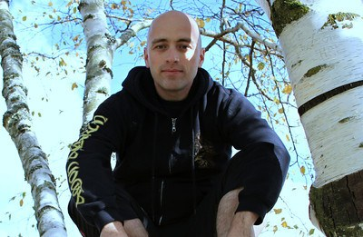
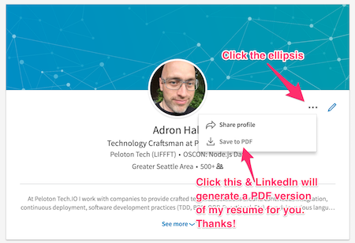

    

Yup, that’s me in a tree, hanging out on a beautiful day in Portland sporting my Amon Amarth hoodie. Don’t know who Amon Amarth is, click the image to find out. If you’re interested in contacting me, please give the list below a quick read over, and at the bottom of this page I’ve got a few requests to save us both time when contacting me!

***A Little About Me:***

I’m a jovial, proactive, test &amp; code, code & test, get things done well, software architect, engineer, code monkey, coder, and distributed systems advocate. Some of the things I've enjoyed doing over the years.

* **Coder:** I write code, sometimes lots of code, sometimes a little code. No language is a limit, only another tool to implement solutions. I ply  polygot language paths including: C#, JavaScript, lately while learning some Go, while I've used Java, Erlang, Pascal, Basic, Visual Basic, C++, C, COBOL, RPG, CL and others in the past.
* **Founder:** I've founded Deconstructed.io with Aaron Gray, [Node PDX](http://nodepdx.org) with Troy Howard, and [.NET Fringe](http://dotnetfringe.org) with a whole host of excellent people and more events are in the works.
* **Messenger:** Every chance I get I work to share knowledge I've gained over the years. Yes, I regularly have opinions and I do like to share those! From workshops, presenting, to one on one mentoring, pair programming, or directed training.
* **Recon:** I love seeing technologies built and technologies come together. I routinely scour the internet, engage in conversations with leaders of thoughts, and thinkers of new things, as I like to contribute where I can and am always thinking of what's next. 

Besides all that technology stuff, I dig some good coffee, great beer, wine, food and a good music show. I cycle, almost everywhere these days, don't own a car (but I'm a car snob of the serious racing sort auto-x, tuners, drift, rally, etc), I verge on the "transit nerd" and "rail nut" category along with "plane spotter" and "exotic car driver". I also play guitar - primarily thrashing (metal), love to prog with some Jazz, croon along with some blues, and delve into a range of musical nuances.

...and I'm sure that misses a few things, but I think it gives a good overview of where you'd usually find my mind and I.

##  Social

Want to talk, chit chat, argue, discuss, debate, or otherwise communicate? These are the mediums.

* [@Adron](https://github.com/Adron) and past work related archived accounts: [@adron_orange](https://twitter.com/adron_orange) and [@WebtrendsAdron](https://twitter.com/WebtrendsAdron).
* Composite Code @ [blog.adron.me](http://blog.adron.me/)

##  Resume

    

* <a href="http://www.linkedin.com/in/adron" target="_blank">My LinkedIn</a> (Which has all my resume information and a lot more). Also there's a new way LinkedIn provides a PDF for any LinkedIn user, just click on their profile and you'll see the following. 

* Do you have a job I might find interesting, just [let me know here](/docs/job-talk/) and we'll talk. If I'm not game, I regularly know others that may be looking.

Currently I'm pretty busy delivering some sweet immutable infrastructure, actively involved in the community here in Portland, Oregon, writing a ton of polyglot code, and generally staying active. So to save time for you and I when contacting me for a chat about software, technology, jobs, or a related topic, please tweet at me (@adron) with a direct message (you may have to @ me first) the following information:

* What is your favorite beer, coffee, or beverage to enjoy in [Cascadia]()?
* What is your favorite thing to do in your spare time?
* ...and specifically why you're contacting me related to tech/software/etc.

You could phrase it as "*I love a Coava Cap in the AM hours and enjoy relaxing along the Portland waterfront after a good ride over the Tillikum Bridge. I'd love to chat with you about... X, got a few?*" and I'll respond ASAP.
