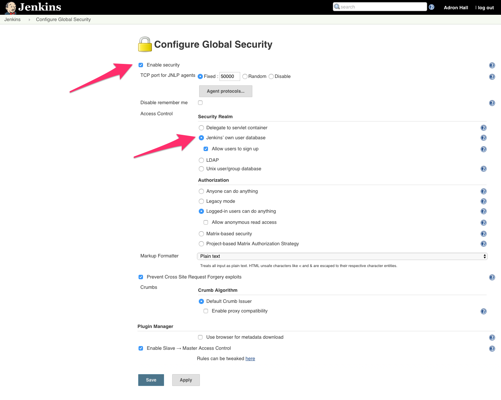
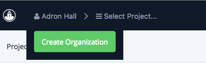
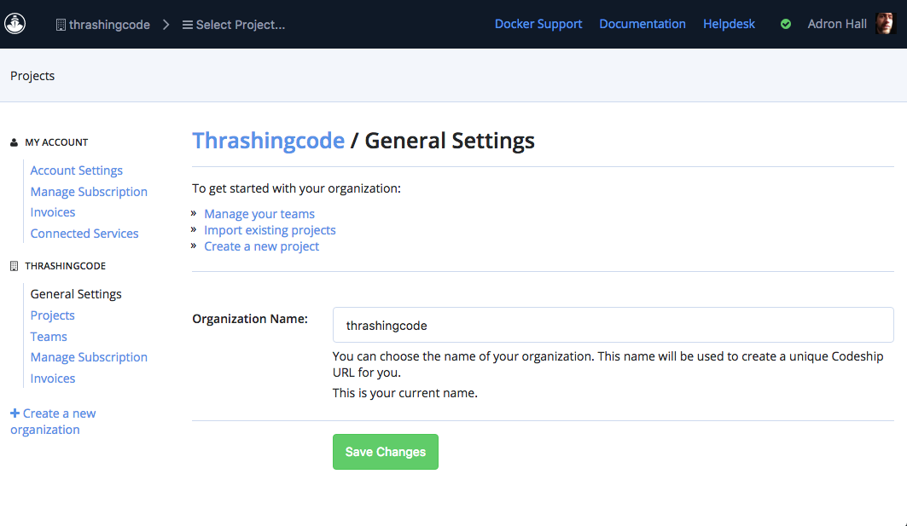
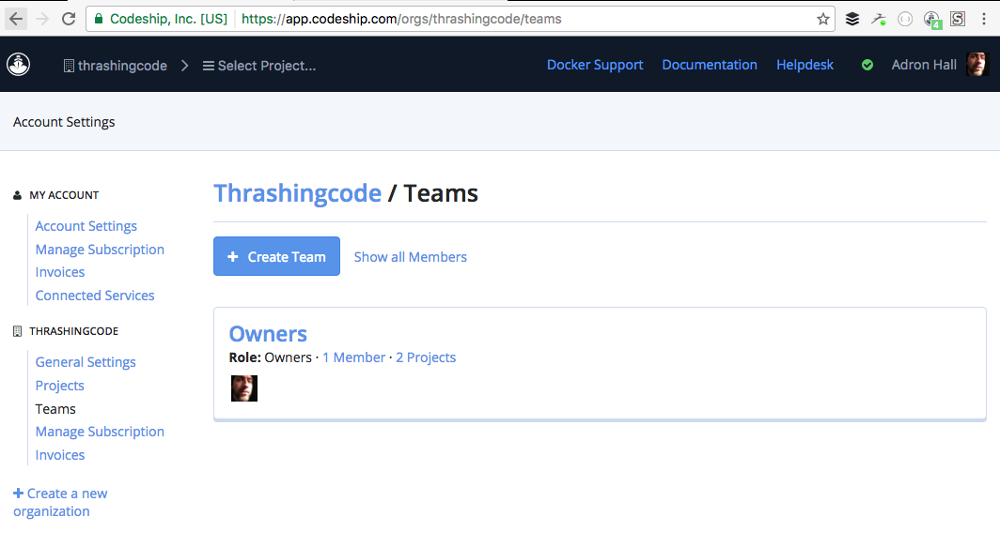
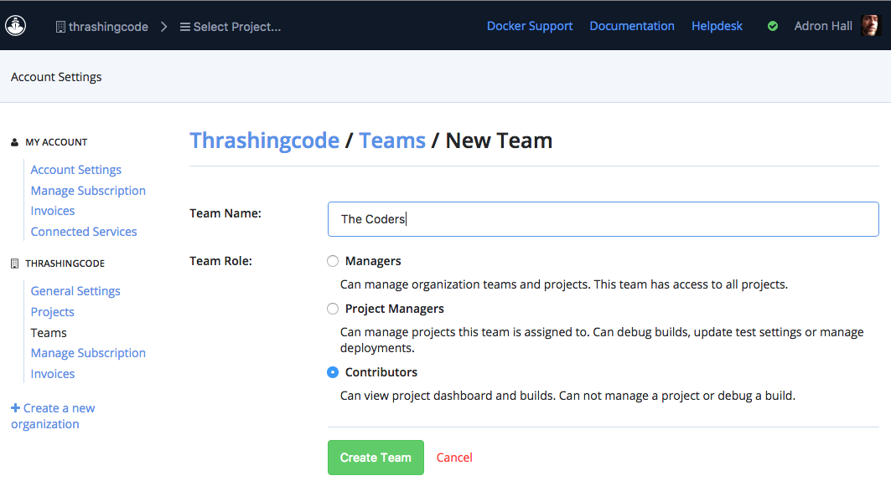
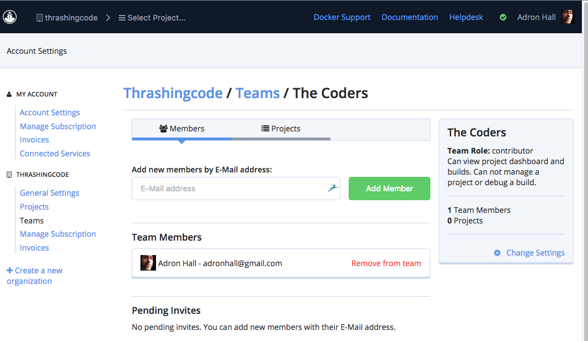
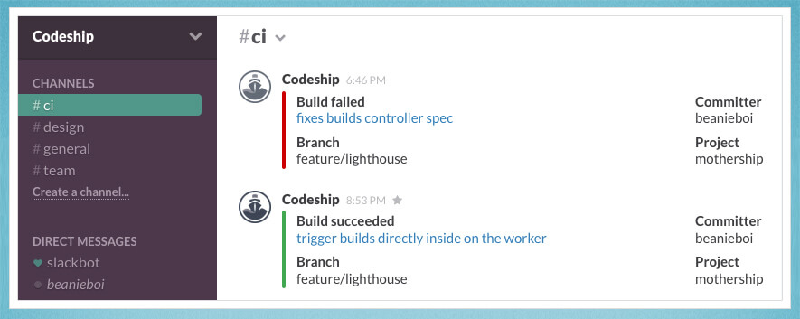
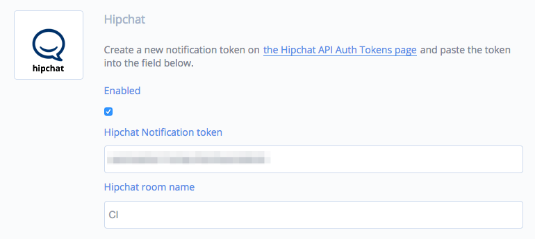
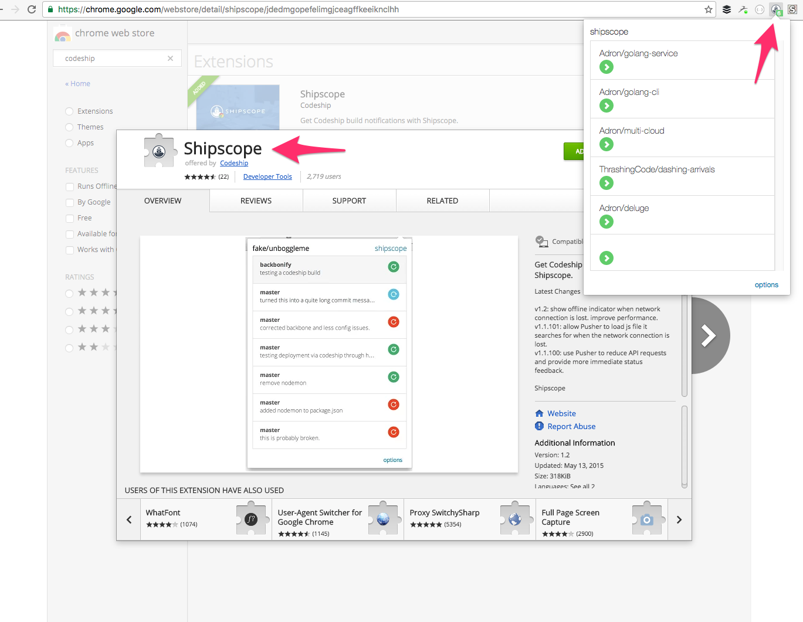

In this blog entry I’m going to tackle a top X list of migration steps to get from Jenkins to CodeShip. There are many things that might be involved in a migration from Jenkins to CodeShip. This short guide will provide information about some of the most routine migrations, but if you know of others or are working on a migration yourself, please let us know and we’ll be happy to add more migrations to this list!

## Users, Roles, & Organizations

The default installation of Jenkins provides a built in database option around creation of users.

  

These users are then used to authenticate to and work with the server. They're setup using the default *Allow users to sign up* settings shown in the above screenshot. There is also various plugins around single sign on integration with systems and other tools, and there are plugins around roles available too.

    

Depending on your setup different steps may be needed. To migrate from Jenkins to Codeship however, you have several key options on settings up users and organizations, the key structural element for organizing users, within Codeship.

Once an organization is setup within Codeship, you can import existing projects, start new ones, create teams with roles, and add users to any of those specific assets. You can see many of those options below on the organization management screen.

In this screenshot, you can see the teams page where you can create a new team, setup owners, members, and setup projects assigned to a team.

When setting up a team a specific role can be assigned.

* Contributors - These are individuals that need to view project dashboards and builds.
* Project Managers - These individuals are people who can manage projects that the team is assigned to. They can also debug builds, update test settings or manage deployments.
* Managers - These individuals can manage organization teams and projects and have access to all projects.

Then finally setting up members and projects within a team.

All of these features combine to provide a relatively seamless way to bring over projects, teams, and respective individual users from Jenkins over to Codeship.

## Notification Integration with Slack, Github, etc.

    

Jenkins has a number of ways to get notified of build status, commit information, and a whole host of other elements of information. To implement most of these in Jenkins requires a simple plugin of some type and then configuring that plugin. Of course among all of these types of notifications and elements of information that are displayed in the notification the most common type is still the simple build fail or build succeeds notification.

To migrate these notifications from Jenkins to Codeship is pretty easy. What I've found works best is to simply get a list of notification types that are in use among the team and then reimplement each of those specific to the developer that want the particular notification. Here are a few ways to get notified of build status or related information with Codeship.

* Slack - Slack integration works with webhooks to deliver updates to builds and related information.

* Hipchat - The Hipchat plugin for Atlassian's Chat Client provides notifications for builds, and additional information and links back to commits.

* Google Chrome Browser - Codeship has a browser component called [Shipscope](https://chrome.google.com/webstore/detail/shipscope/jdedmgopefelimgjceagffkeeiknclhh) ([Github Repo](https://github.com/codeship/shipscope)) that they [introduced a few years back](https://blog.codeship.com/codeship-notifications-desktop-shipscope/). It provides an immediate status of the builds for various projects, as shown here.

## Docker Support & Use

Currently most pipelines running on Jenkins don't run with some sort of Docker containers, or any containers for that matter. Jenkins follows a much more traditional feature set around static pipelines that build specific to an operating system and what is loaded on that operating system to build software and its various packages. Flipping that on its head you will find that Jenkins is sometimes run inside of containers itself.

Codeship however works from the premise that the pipeline works from its core with container technology. After all it's built to use containers to execute each build autonomously in an entirely new environment each time. A great way to build integrity in the solution and the build.

Another great way to gain capabilities with containers and Codeship is to use the Codeship Pro features around Jet (?)
