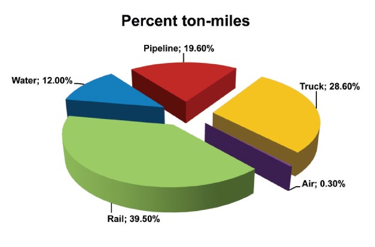
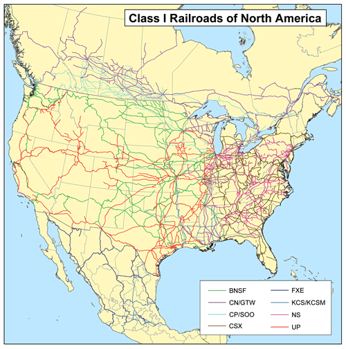
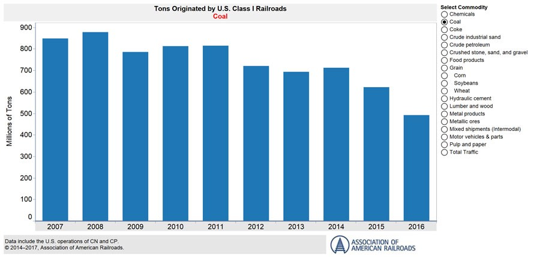

[original post on Medium](https://medium.com/@adron/big-ole-invisible-freight-railroads-lets-talk-volumes-5f159d563194)

Let’s talk about freight shipments in the United States for a moment. You often see 18-wheelers and such hauling stuff back and forth on the roadways, but did you realize they only account for just shy of 30% of freight movement in the United States? At least by ton miles carried, railroads carry a whopping 40% (see this and . That’s right — the relatively invisible, barely interruptive, much cleaner than 18-wheelers or planes — freight railroads!

    

For an overview of freight railroads check [this link](https://www.fra.dot.gov/Page/P0362).

Let’s talk about a few other things. The road systems in the US, which have the largest amount of road damage costs attributed to weather and trucking, cost the US taxpayer over $100 billion a year. That’s often $100 billion beyond the $38–42 billion a year in gas taxes we pay ([more](https://www.artba.org/about/faq/#3ce542cddf7d6db1c)). The railroads in the United States however rarely take any taxpayer money and rely almost solely on shipping fees paid by customers. Freight railroads are one of the only entities that actually pay the vast majority of their costs in operation, capital costs, and even beyond that, unlike those [dastardly automobile hand-outs, car welfare, and related subsidies](https://www.theatlantic.com/business/archive/2015/10/driving-true-costs/412237/)! They even contribute back to society with business expansions in communities, charity programs, and more (read here, here, and here). Overall, the freight railroads have built, continue to build, and continue to be one of the greatest industrial assets this nation or any nation has ever seen. But I do digress…

## That Freight Railroad Data

I didn’t actually start this post to yammer on about how cool and great the freight railroads are. I wanted to talk about some data. You see, I wanted to get hold of some interesting data. I find the massive freight movements of the railroads, and overall in the United States, rather interesting. Thus I set out on a quest to seek out and find all the data I could. This is the path and data I found, and soon you too will find this data showing up in the applications and tooling that I build and distribute — via open source projects and other means — to you dear reader!

Just for context here’s some of the details of the data I’m going to dig into. The following data is primarily monitored and managed for markets and regulatory reasons by the Government entity called the [Surface Transportation Board](https://www.stb.gov/), or [STB](https://www.stb.gov/). The STB’s website is straight up circa 1999, so it’s worth a look just for all that historical glory! Anyway, here’s the short description from the STB’s site itself.

> The Surface Transportation Board is an independent adjudicatory and economic-regulatory agency charged by Congress with resolving railroad rate and service disputes and reviewing proposed railroad mergers.

> The agency has jurisdiction over railroad rate and service issues and rail restructuring transactions (mergers, line sales, line construction, and line abandonments); certain trucking company, moving van, and non-contiguous ocean shipping company rate matters; certain intercity passenger bus company structure, financial, and operational matters; and rates and services of certain pipelines not regulated by the Federal Energy Regulatory Commission. The agency has authority to investigate rail service matters of regional and national significance.

    

The STB is one place that has a lot of regulations in which garners up a lot of data from the class I railroads. Overall these class I railroads make up the vast bulk of railroads in the United States, and also Canada and Mexico! Overall, there are over 140,000 miles of track that the railroads operate on. All built and managed by the freight railroads themselves, except for a few hundred miles in the north eastern area of the United States. For comparison that’s 140k miles of railroad and our [Eisenhower Interstate Highway System](https://en.wikipedia.org/wiki/Interstate_Highway_System) is only 47,856 miles, and costs about [$40–66 billion](https://www.quora.com/How-much-money-is-spent-to-maintain-the-US-interstate-highway-system-per-year) per year ([amazing Quora answer w/ tons of ref links](https://www.quora.com/How-much-money-is-spent-to-maintain-the-US-interstate-highway-system-per-year)) just in maintenance and upgrades!

The defining classification of railroads in the United States by the simple designation [class 1 railroads](https://en.wikipedia.org/wiki/Railroad_classes#Class_I) as listed on Wikipedia.

In the United States, the [Surface Transportation Board](https://en.wikipedia.org/wiki/Surface_Transportation_Board) defines a Class I railroad as “having annual carrier operating revenues of $250 million or more in 1991 dollars”, which adjusted for inflation was $452,653,248 in 2012.[1](https://en.wikipedia.org/wiki/Railroad_classes#cite_note-class_i_def-1) According to the [Association of American Railroads](https://en.wikipedia.org/wiki/Association_of_American_Railroads), Class I railroads had a minimum carrier operating revenue of $346.8 million (USD) in 2006,[2](https://en.wikipedia.org/wiki/Railroad_classes#cite_note-2) $359 million in 2007,[3](https://en.wikipedia.org/wiki/Railroad_classes#cite_note-3) $401.4 million in 2008,[4](https://en.wikipedia.org/wiki/Railroad_classes#cite_note-4) $378.8 million in 2009,[5](https://en.wikipedia.org/wiki/Railroad_classes#cite_note-5) $398.7 million in 2010[6](https://en.wikipedia.org/wiki/Railroad_classes#cite_note-aarstats2012-6) and $433.2 million in 2011.[7](https://en.wikipedia.org/wiki/Railroad_classes#cite_note-aarstats2013-7)

## Association of American Railroads (AAR)

The AAR provides a number of rolled up data points, tons carried totals, and many other interesting pieces of data in their data center pages. This isn’t always useful if you want data to work with, but it was one of the first sources I regularly stumbled upon in my search for actual load data and such.

The AAR also posts weekly load data totals which shows some pretty awesome graphs of ton loads and related. There are a lot of things that can be discerned from this data too. Such as, unlike Trump’s stupid declaration about something something coal this and coal that, it’s dying off as a commodity for energy.

    

Anyway, amidst the STB and AAR I kept digging and digging for APIs, source data, or something I could get at that had a better granularity. After almost an hour of searching this evening I realized I was getting into this mess a bit deeper than need be, but hot damn this data was fascinating. I am, after all a data nerd, so I kept digging.

I finally stumbled on something with granularity, at least daily, with [YCharts](https://ycharts.com/indicators/us_weekly_rail_traffic). but the issue there was I had to sign up for a subscription before I could check anything out. So that was a non-starter. Especially since I didn’t even know if the granularity would go down to what I’d like to see.

Realizing that looking at regulatory bodies and related entities wasn’t going to get down into the granularity I wanted, I got curious about the individual railroads. There are only 7 class I railroads so why not dig into each specifically. Off I started on that path!

The first thing I stumbled on with this change in effort is this hilarious line, ***“Union Pacific’s Lynden Tennison doesn’t exactly have a problem with “Big Data.” But unlike most CIOs, he wants one.”*** in this post about the big data. I immediately thought to myself, “Oh LOLz do the railroads really even know the data they’re collecting, surely they do, but maybe they’re not even sure where it’s actually at!” Of course, this is entirely possible that they’re all just sitting on this treasure trove of data and it’s being squandered off in some regulatory office of bean counters versus actually being available to innovate on. For the railroads or others for that matter. Albeit I’ll give Tennison at least he’s probably on the right path, Union Pacific hasn’t been doing a bad job lately.

I then found the weekly and related reports on Union Pacific’s site under their [data area](https://www.up.com/investor/aar-stb_reports/). But again, this was duplicated PDF files that I saw in the AAR reports. Not very useful to work with.

As I realized this was an effort in vain, I also stumbled upon the reality that the railroads buy big hardware and software, vastly overpriced, to do very specific things with. The costs tend to be validated in operational improvements, but much of it is overpriced IBM or Oracle deals where they’re getting raked over the coals. In other words, IBM and Oracle are landing some sweet sales but the railroads aren’t. It kind of makes them all that much more impressive that they cost Americans so little actual money and provide such a massive service in return.

With that, my efforts end without success for today. But I’ve gained a few more tidbits of trivial knowledge about the STB and AAR that I oddly enough, as a fan of rail systems, didn’t have. Thus, it was kind of successful.
Oh well, back to searching for other interesting data to work with!
