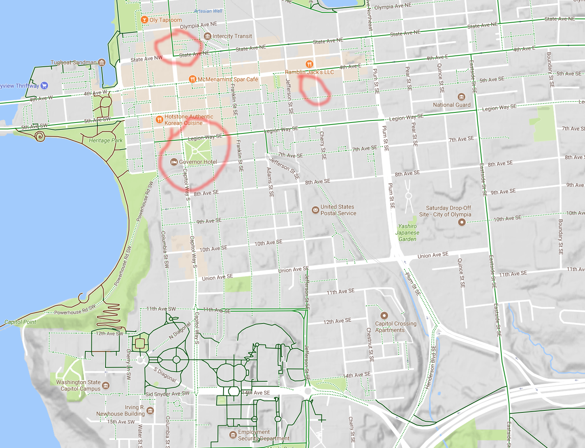
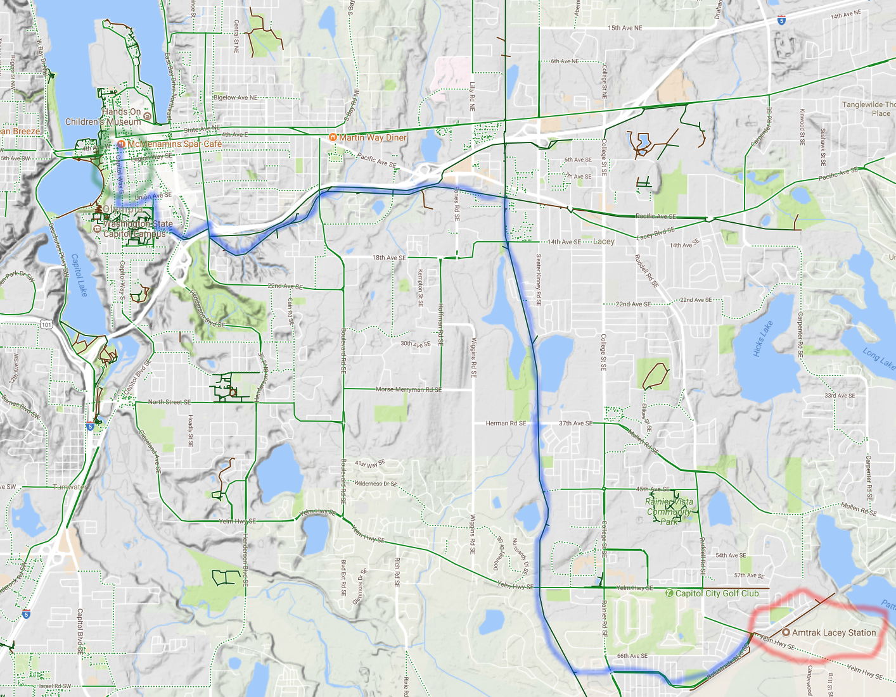

[original post on Medium](https://medium.com/@adron/last-weeks-travels-on-monday-2am-ae1d6942ddae)

The last week has been a lot of fun travels, great meetups, and solid meetings. All focused around several key topics;

* traveling to nearby cities to speak & present on immutable infrastructure with Terraform and Kubernetes and…
* meetings to help build next generation applications for medical, personal, and privacy tracking information.

Before rolling into this week I wanted to put together a quick recap of events and meetings.

The travel consisted of an easy trip to Olympia. I always love traveling to Olympia, and in normal Adron fashion I do it my way, which consists of no cars but a lot of other fun stuff. Olympia, you see, isn’t exactly on the beaten path anymore except for auto-travel, and even then it’s off down a dead end Interstate cut off. But I’m sure that this is part of the beauty of this small city. It helps keep it free of arbitrary “pass through” traffic of people who’d not care or just toss their trash randomly about the city.

One can study this phenom with cities in the US which have an Interstate cut through them, with exits, and an Interstate that goes around the city. Massively different results, the later letting a city retain cleanliness and it’s own much better then the aforementioned technique.

Olympia, I might add is one of the few small cities that really retains a lot of the zeal and attractiveness of the gritty northwest vibe of yesteryear. Oly, as it’s oft referred has tons of unique, local, individualistic shops and street culture. One might be amazed to see such a thing in such a small city, but Oly is one of those few places that bats above its weight. It’s definitely worth visiting.

Each visit to Olympia that I’ve taken I stay at a few different places.

* Sometimes at my buddy Bobby’s house.
* Sometimes at an airbnb.
* Regularly at the Governor in downtown.

The Governor in downtown is this classic 50’s era hotel. It faces the old Capital across the park, just near where the new capital is, but the benefit is its even closer to downtown Olympia. Here I’ve scratched a circle around it, where I go to speak just north of the hotel at the [South Sound Developers User Group](https://www.meetup.com/ssdevelopers/), and then we always retire to the east at [Fish Tale Brewing](https://www.fishbrewing.com/fish-tale-brewpub).

    

The trip to Olympia I enjoy immensely. It all starts with the standard [Amtrak Cascades](http://www.amtrakcascades.com/) departure from Seattle at [King Street Station](https://en.wikipedia.org/wiki/King_Street_Station). The departure was on time, as was the arrival, which is something that is pretty standard on our northwestern Cascades train routes. I don’t always expect them to be, being US trains, but these are pretty reliable here.

After the scenic and relaxing coding session on the train, I arrive at the station in Olympia. This station is a cute little deal, located in the suburbs on the freight line about ~8 miles or so east of downtown Oly. You see, in typical American fashion the state, federal regs, and railroad(s), along with a failure of foresight by previous generations decided they’d tear up the track connection to the station that did exist in Olympia. This station, of course, was built around people traveling from Oly to other places, and was built intelligently, as we tended to do in long lost past decades. But hey, I arrived at the new station and as I generally do, I had a plan already sorted.

I’ve put together a few photos and a video short for the trip too, enjoy.

My path along the Chehalis Trail into Olympia

    

Looking at the *Old* Tracks in Olympia along Colorful Leaves

    

There’s a spectacular trail that is very close to the station that I take built upon an old rail line that was abandoned. Here’s a map with the trail highlighted along with the northern and southern connecting routes. At the southern end I’ve circled the Amtrak Lacey Station (Lacey, being where it is actually located, I always call it Olympia though because that’s the distinctively larger city!)

    

I might muster some time to post the other images and video from the trip later. But for now, this is it. In other news, I’ve got my “[Secret Business Brunch n’ Bike](https://www.meetup.com/Lifestyle-Hackers-Cyclists-and-Brunchers/events/244091201/)” brunch lunch scheduled tomorrow at Hi-Life @ 11, and also [Beers on Wednesday](https://www.meetup.com/Lifestyle-Hackers-Cyclists-and-Brunchers/events/244166333/). Feel free to join me, always hacking, biking, and eating something. Cheers!

    

