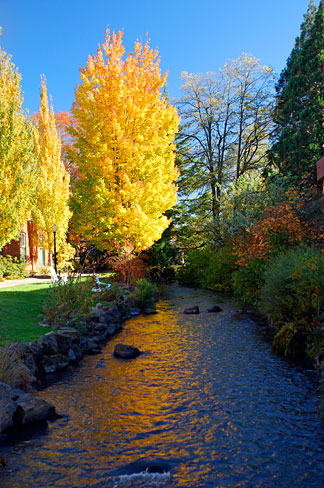
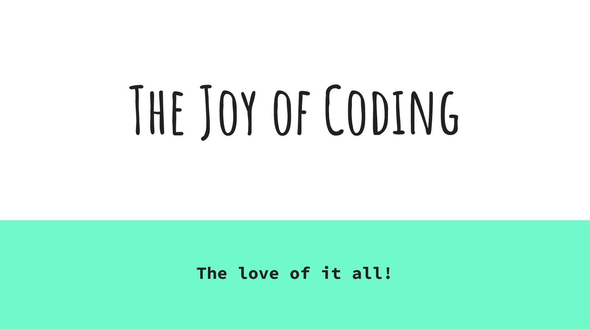

[original post on Medium](https://medium.com/@adron/speaking-coding-and-visiting-salem-oregon-b80533464006)

I like to take a trip down to Salem every now and again. It’s a great chance to break away from the daily grind in the bigger city. When I lived in Portland or now in Seattle, it didn’t matter, still a great small city to go visit. The other cool thing is

I can often combine business and taking a break at the same time in Salem.

## The City

Even though it’s a small city it bats way above its size when it comes to excellent food, coffee, beer, and related things. This is always nice to combine with that slower pace of things that a small city provides. The downtown is also beautifully walkable and compact. One can walk to any point in the city in a matter of minutes.

The coffee scene there is seriously on point too. With establishments like The Gov Cup and Archive providing premium coffee options in truly relaxed, chill, and comfortable settings it makes doing a little work and enjoying some espresso an easy thing to do.

Combine that with my other requirements of easy to get to, easy to bike, non-hostile drivers, and beautiful parks and natural environments around and Salem is perfect.

## The Tech

    

Combining all the aforementioned things with some tech makes everything even more fun! In Salem there’s a group I’ve spoken at a few times called [Willamette Valley Software Engineers](https://www.meetup.com/WVSE-meetup/). It’s a solid group of people, where I regularly gather an audience of 40+ people to present to, converse with, and we often continue onward after presentations across Mill Creek to [Boon’s Treasury](https://www.mcmenamins.com/boons-treasury) for conversation a round afterward.

    

This recent trip I presented, with direct inspiration from Bob Ross, on “[The Joy of Coding](http://blog.adron.me/talks/joy-of-coding/)". It was the first time attempting to put a talk together in this format. Overall, I believe it worked out pretty well, which the audience elaborated on after the talk on ways I can tidy up this or that and really add some “wonderful trees and forests to the grand mountains” of the presentation as a painting. I’ll be presenting this again and hoping to put a video of the talk together soon. So stay tuned to [Composite Code](http://blog.adron.me/) and follow me on Twitter [@Adron](https://twitter.com/Adron) for future dates.

All in all a great trip. I always enjoy Salem. So until another time, cheers Salem!
