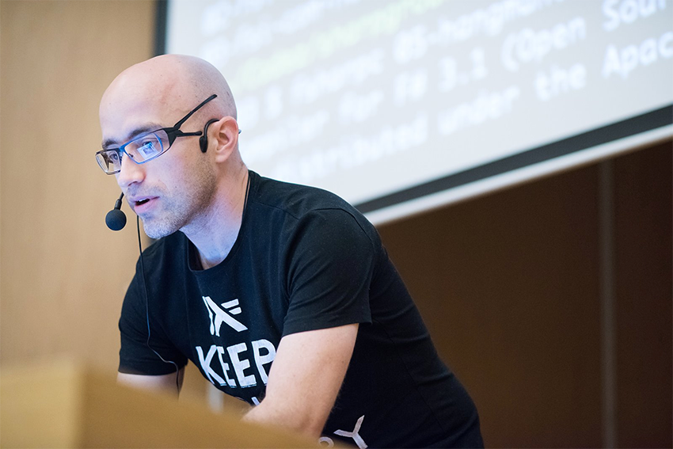
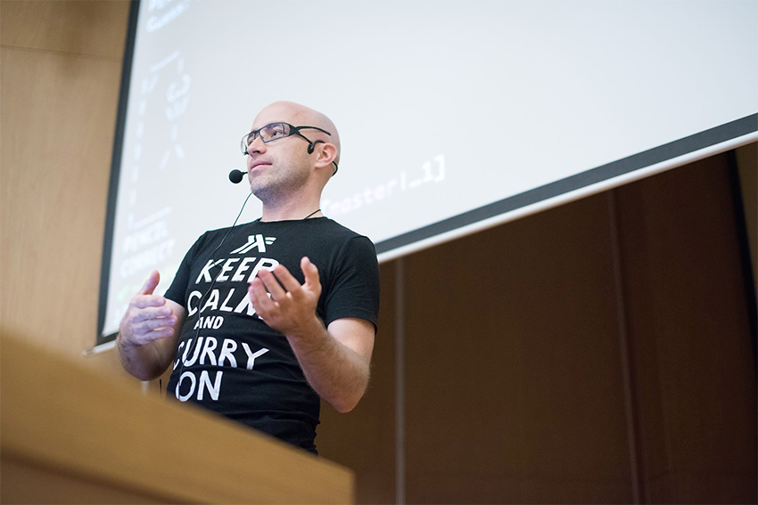
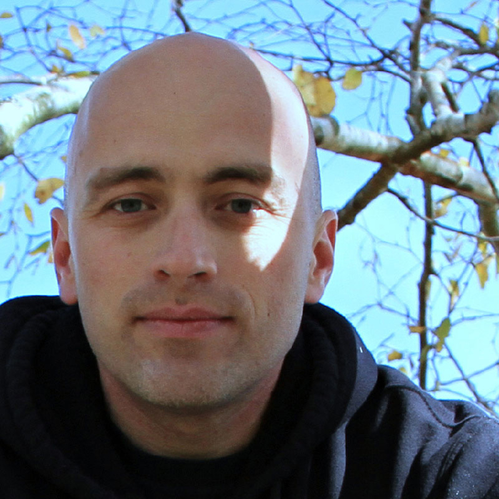
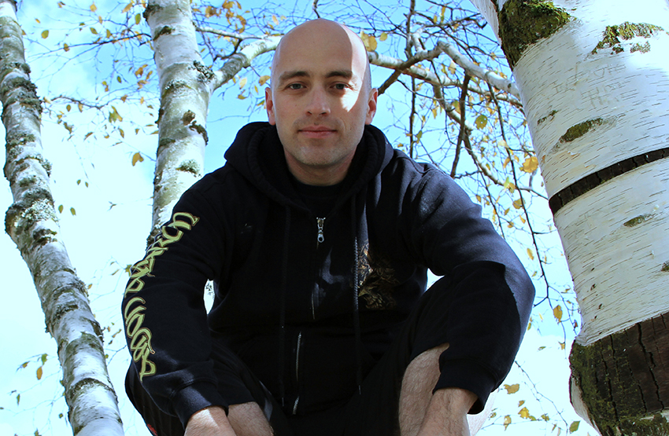
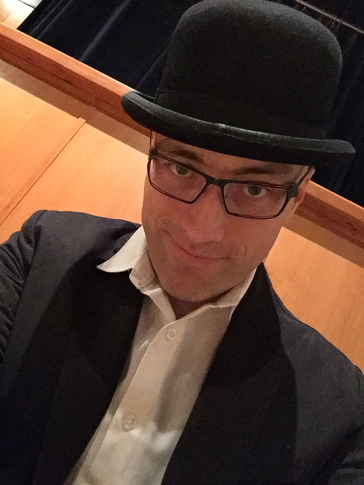
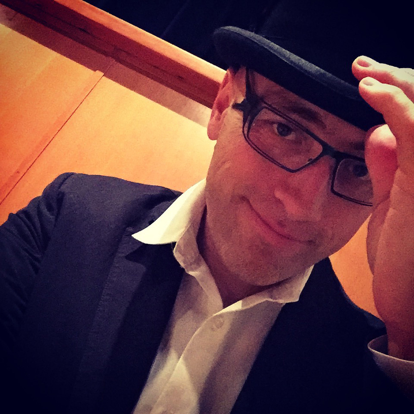
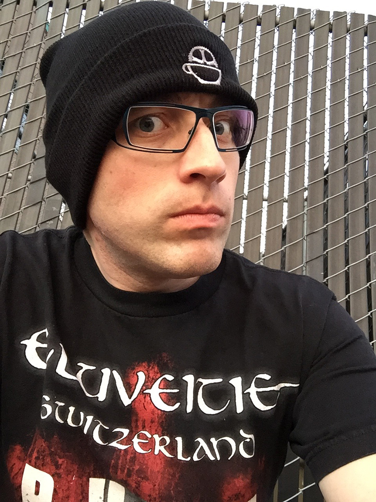
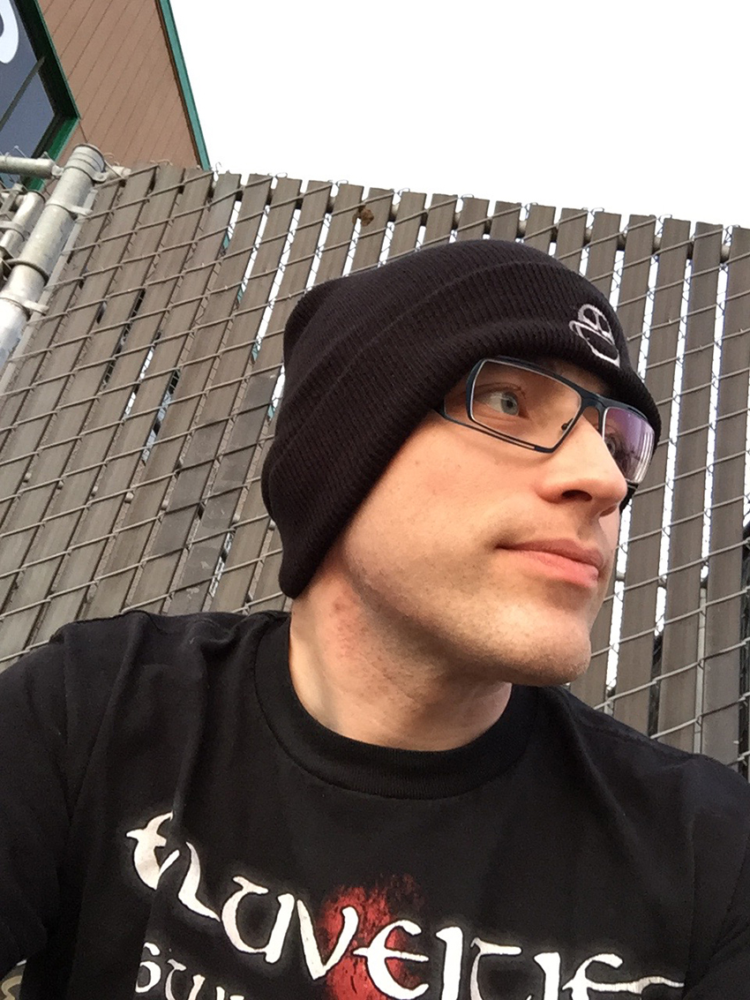
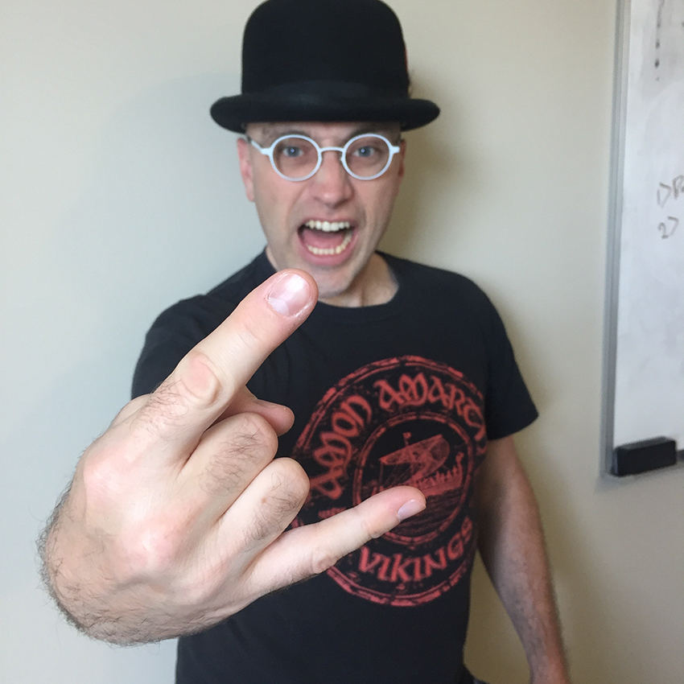

I've collected my personal speaker details here, which can be used for assets in site listings, for conference, meetup talks, and related display. If you have any questions, feel free to DM me (or just tweet at me) via Twitter [@Adron](https://twitter.com/Adron). 

## Third Person Description

### Description One

Adron has worked in the technology industry from team leadership, product design efforts, coding in trenches, to wearing the DevOps hat and being on call. With this experience and a jovial spirit, Adron likes to teach, build organizations, create systems, and help teams get things done. He's a coder at heart, with an advocate's (maybe an activist's) energy.

### Description Two

Adron is often referred to as the ***"guy with solutions"***. If there's a question about how something should be built, he is the go to guy for coming up with how to get things done, deployed, and into production. With his calm and collected demeanor, and sometimes snarky wit, Adron is the person you want building teams and creating systems. His ability to impart upon others energy, knowledge, and enthusiasm is exceptional.

## First Person Description

I’m a jovial, proactive, test &amp; code, code & test, get things done well, software architect, engineer, code monkey, coder, and distributed systems advocate. I go by the title of "Coder, Messenger, Recon" as it seems to encompass what I do.

* **Coder:** I write code, sometimes lots of code, sometimes a little code. No language is a limit, only another tool to implement solutions. I ply  polygot language paths including: C#, Java, JavaScript, Erlang lately and Pascal, Basic, Visual Basic, C++, C, COBOL, RPG, CL and others in the past! 
* **Founder:** I've founded <a href="http://deconstructed.io/" target="_blank">Deconstructed.io</a> with Aaron Gray, <a href="http://nodepdx.org/" target="_blank">Node PDX</a> with Troy Howard, and <a>.NET Fringe</a> with a whole host of <a href="http://dotnetfringe.org/index.html#team" target="_blank">excellent people</a> and more are in the works.
* **Messenger:** Every chance I get I work to share knowledge I've gained over the years. From workshops to one on one mentoring, pair programming or directed training. 
* **Recon:** I love seeing technologies built and technologies come together. 

But besides all that techno stuff, I dig some good coffee, great beer, wine, food and a good music show. I cycle, almost everywhere these days, don't own a car (but I'm a car snob of the serious racing sort auto-x, tuners, drift, rally, etc), I verge on the "transit nerd" and "rail nut" category along with "plane spotter" and "exotic car driver". I also play guitar - primarily shredding (metal), love to prog with some Jazz, croon along with some blues.

## Photos

