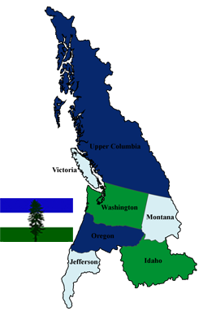

## Organizing Infrastructure Config and Workflow
### *@ [HashiConf 2016](https://www.hashiconf.com/) September 6-8, 2016*

***...Updated as of September 4th, 2016***

## Slides

<iframe src="https://docs.google.com/presentation/d/1obA_NypaK3tTC_NansiKqV4GaRZ2JEARkG1ZHxjQ7Rk/embed?start=true&loop=false&delayms=3000" frameborder="0" width="850" height="507" allowfullscreen="true" mozallowfullscreen="true" webkitallowfullscreen="true"></iframe>

## Abstract

When starting with the various products Terraform, Packer, Vagrant, and others, it isn't always apparent where and in what way one should organize the actual project. In this talk I'd like to delve into what I've done to organize solutions for development, production, and related pipelines. I'll talk from my point of view and what I've seen others do to keep their workloads organized and their infrastructure and application pipelines clean and well organized.

### The Presentation

**The Why**

1. To show, mentor, or teach all of you what we’ve been working on that you would hopefully find useful.
2. To speak with you - after or before this talk about what you’re working on that can benefit us, and how we can benefit you. We want this to be win - win.

**Home Depot & Google Cloud Platform**

    

Currently I work with Home Depot building out infrastructure and services for what is called Quote Center. This is the custom order application that allows Home Depot to put together custom orders for builders and others that have specific and unique requirements for their orders.

    

[Google Cloud Platform]()

My co-presenter Evan works with the Google Cloud Platform team bringing together key elements around Bosh, Pivotal Cloud Foundry, Terraform, and other pieces for various customers. I've had the fortune of working with Evan as a customer of AWS & GCP since he was a chef of awesomesauce at AWS.

### The Work Described in Presentation

**What & Where**

    

We're a team that is autonomous from the Home Depot IT Organization, albeit still fully connected, which also gives us unique autonomy to build, scale, and implement unhindered. This allows us to really focus on our specific business units' needs. This provides us a kind of "laboratory" status here in [Cascadia](https://en.wikipedia.org/wiki/Cascadia_(bioregion)).

**What We Have**

Our environment is a language and operating system polyglot dream (or mess depending on one's POV). The mix of operating systems, system workflows, and languages with their respective stacks all around make for a challenge that either defeats the soul or stirs the passion. For me, I get lit up with excitement over getting it to interoperate and smoothly work.

Our core applications do fall along using the Node.js, JavaScript, and .NET Stacks. But beyond that core functionality we have data anlytics projects getting built on Kafka, Zookeeper, and a host of microservice style stacks on various Linux distributions and Windows Servers.

**Where We're Going**

Another important situational report I need to provide everyone is the fact most of this infrastructure exists where we don't want it and we're in the process of migrating entirely to Google Cloud. This is what the ideas here will involve, is Google Cloud and the work I’m doing to get us migrated to and deploying to Google Cloud.

### Our 3 Eras

#### **Legacy "Iron Throne Era"**

Some of the key identifying characteristics of systems in this era include:

* System won’t work
* System sort of works
* System can’t move
* System is barely (or not) Internet ready

This is the term we've started to use, currently, for the definition of legacy in relation to migration/operation in Google Cloud. We’re fortunate at Home Depot in the Quote Center, in that we generally we don’t have applications in these realms. But, there are a few.

#### **Infrastructure "Renaissance Era"**

* Google Compute Engine
* System Applications

This era and system type includes things that are solely focused around the traditional systems administration and deployment style of "a server" with everything built on top. More simply, think of this as systems that run on a singular, or maybe a manually created cluster within Google Compute Engine.

Another aspect of this era, which is easier to define, is an application that is traditionally hosted, built, or maintained. Think of applications like JIRA, Enterprise Github, SQL Server Reporting Services, or even SQL Server itself. These applications or servers on require, and can really only utilize a single instance in most use cases.

These are the systems and applications of the "Renaissance Era".

#### **Applications "Iron Man Era"**

This is the seriously bad ass era of immutable infrastructure, self-deploying applications, that are continuous integrated and delivered. This is where things get fast, exciting, and quality starts to dramatically improve.

More to come, but if you want to join the conversation, see, and hear the presentation you'll have to join Evan and I [@hashiconf](https://www.hashiconf.com/)!

